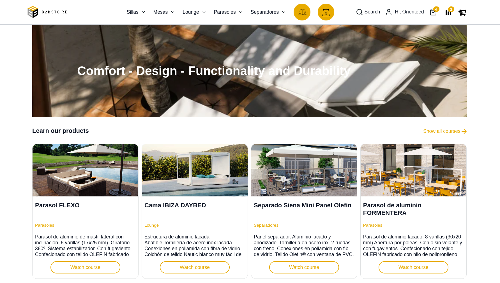
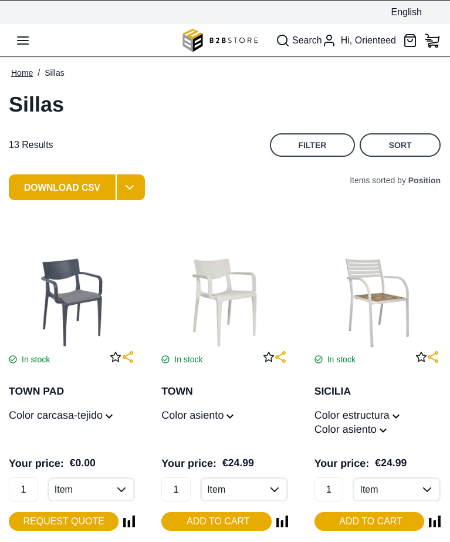
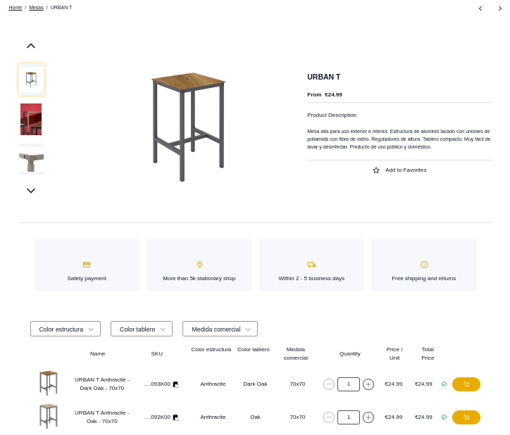
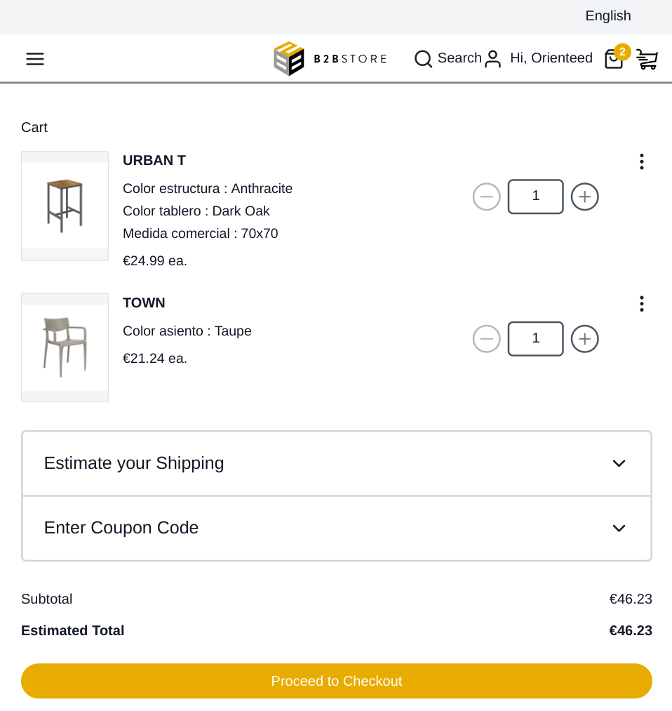
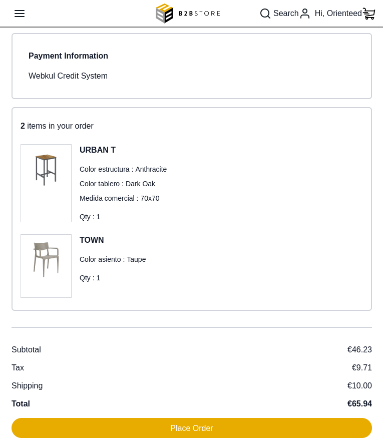
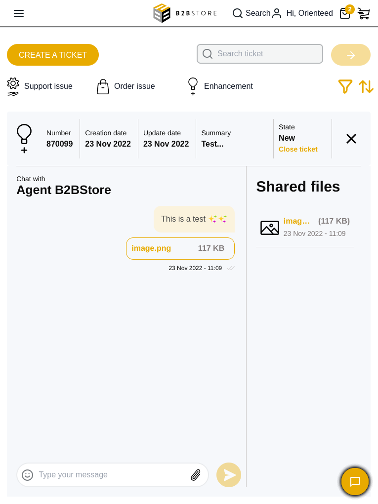
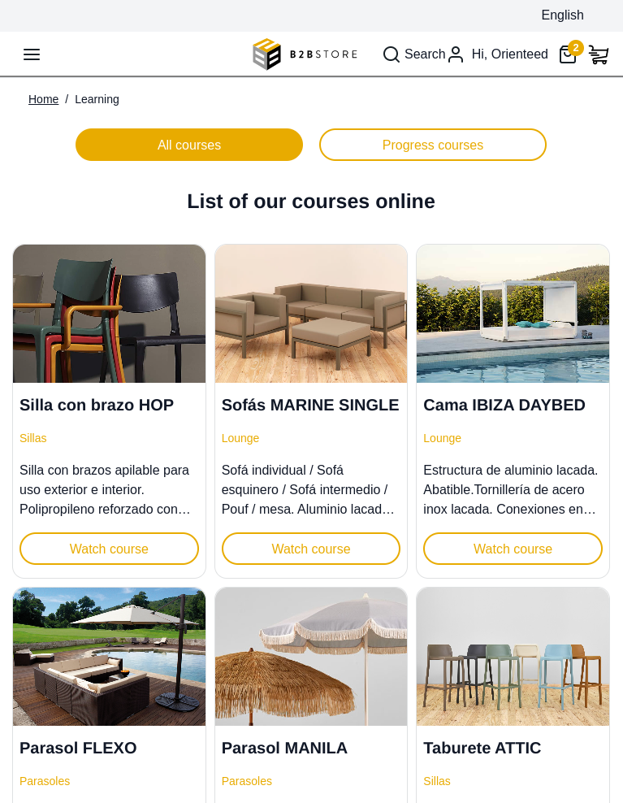
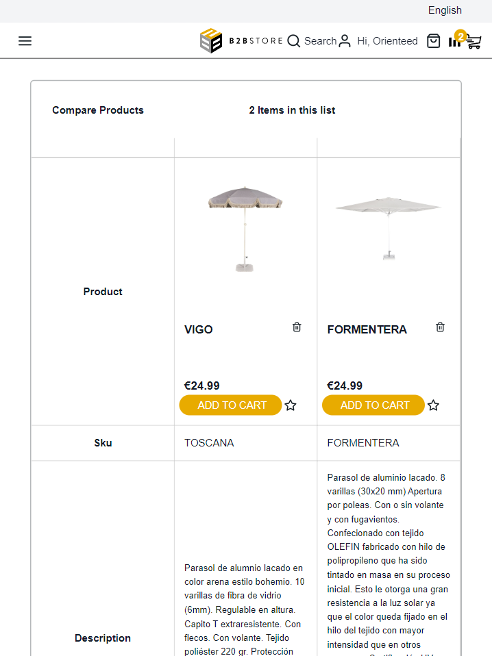
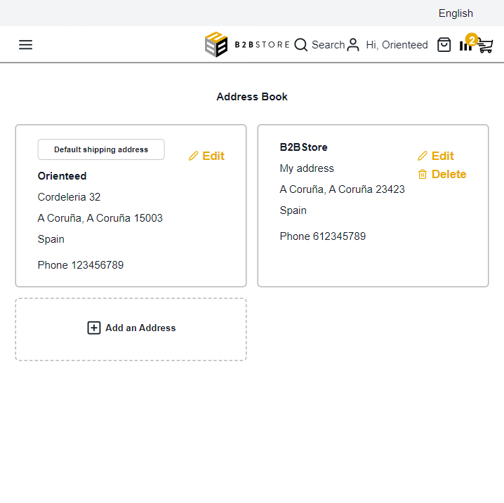
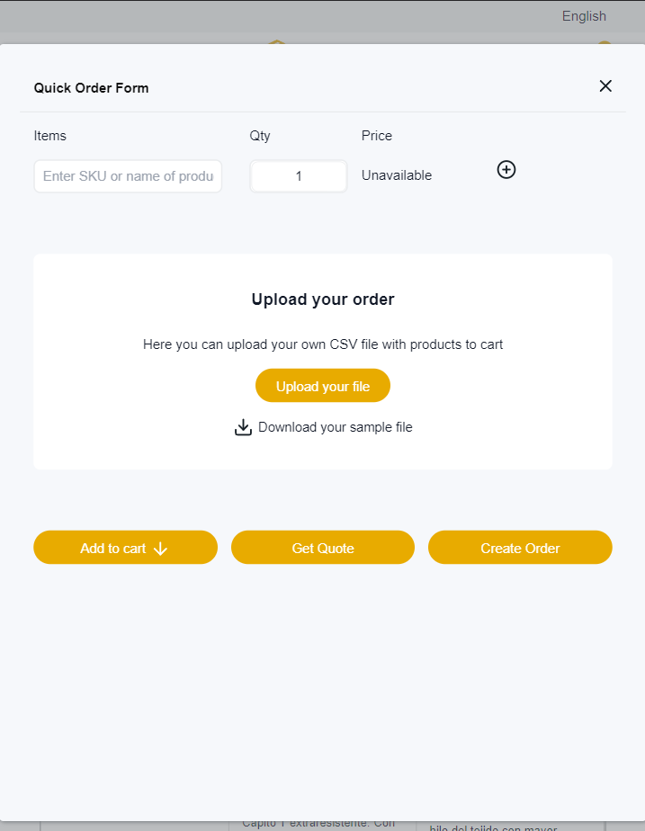

<div align="center">
    
</div>

</br>

# B2B Store, the fork of [PWA Studio](https://github.com/magento/pwa-studio)

#### Table of Contents

- [📢 What is B2BStore?](#-what-is-b2b-store)
- [🛒 Supported Platforms](#-supported-platforms)
- [🔧 Supported Services](#-supported-services)
- [⭐ B2B Store features](#-b2b-store-features)
- [📸 Screenshoots](#-screenshoots)
- [✅ Requirements](#-requirements)
- [⚙️ Installation](#%EF%B8%8F-installation)
- [🙌🏼 How to contribute](#-how-to-contribute)

</br>

## 📢 What is B2B Store?

The B2B Headless Frontend for your ecommerce... Boost your B2B customer journey and performances using a modern, high featured, open source ecommerce platform based on leaders solutions like Magento Open Source and PWA Studio (React frontend).

With our customized solution we make it possible for manufacturers to add value to their distribution chain. Our value proposition is based on a platform with the functionalities of a B2B, adapted to your needs, and that will allow you to go to market in record time.

If you are interested to have our solution as a **FEaaS (Frontend as a Service)**, please <a href="https://www.b2bstore.io/contact" target="_blank">contact us</a>

🚀 Feel free to use our demo: <a href="https://demo.b2bstore.io/" target="_blank">https://demo.b2bstore.io/</a> 🚀
- ✉️ Login: test@orienteed.com
- 🔑 Password: TstAcc2022

</br>

## 🛒 Supported Platforms

<table>
  <tr>
    <td align="center"><a href="https://business.adobe.com/products/magento/magento-commerce.html"><br /><sub><b>Magento</b></sub></a><br /></td>
    <td align="center"><a href="https://www.orienteed.com/en/blog"><br /><sub><b>Stay tuned!</b></sub></a><br /></td>
  </tr>
</table>

</br>


## 🔧 Supported Services
<table>
  <tr>
    <td align="center"><a href="https://zammad.com/"><br /><sub><b>Zammad</b></sub></a><br /></td>
    <td align="center"><a href="https://moodle.org/"><br /><sub><b>Moodle</b></sub></a><br /></td>
    <td align="center"><a href="https://aws.amazon.com/connect/"><br /><sub><b>Amazon Connect</b></sub></a><br /></td>
  </tr>
</table>

## ⭐ B2B Store features

Quick recap of the main features natively offered by B2BStore and strongly suggested for any B2B channel

- Access by Login / credentials
- Quote (Offers) and Request for Quote
- Multiple Saved Carts
- One click re-order
- Order incidence (CSR)
- Quick cart with CSV cart import
- Cart edit adding header/image & updating prices with PDF print option
- Product and List pages specialised for B2B 
- Sales agents organization & access to the dashboard of their customers
- Assignment of a customer to a specific agent
- Buy on behalf
- Checkout personalizations adapted for external platforms (ERP)
- Use of external client number (CRM)
- Advanced pricing based on lists
- Search and add to cart from autosuggestions
- Mega Menu

</br>

## 📸 Screenshoots

The following screenshots are taken from the demo site: <a href="https://demo.b2bstore.io/" target="_blank">https://demo.b2bstore.io/</a>

Take a look at some screenshots of B2B Store:

<div align="center">
  
</div>

</br>


<details>
  <summary>PLP - Product List Page</summary>
  </br>
  <div align="center">
    
  </div>
</details>

<details>
  <summary>PDP - Product Detail Page</summary>
  </br>
  <div align="center">
    
  </div>
</details>

<details>
  <summary>Cart</summary>
  </br>

  <div align="center">
    
  </div>
</details>

<details>
  <summary>Checkout</summary>
  </br>
  <div align="center">
    
  </div>
</details>

<details>
  <summary>CSR - Zammad Integration</summary>
  </br>
  <div align="center">
    
  </div>
</details>

<details>
  <summary>LMS - Moodle Integration</summary>
  </br>
  <div align="center">
    
  </div>
</details>

<details>
  <summary>Compare Products</summary>
  </br>
  <div align="center">
    
  </div>
</details>

<details>
  <summary>Address Book</summary>
  </br>
  <div align="center">
    
  </div>
</details>

<details>
  <summary>Quick Order</summary>
  </br>
  <div align="center">
    
  </div>
</details>

<details>
  <summary>Favorites</summary>
  </br>
  <div align="center">
    
  </div>
</details>


</br>

## ✅ Requirements

The only requirements are to have installed Docker and docker-compose. If you don't have them installed, you can follow the <a href="https://docs.docker.com/engine/install/" target="_blank">Docker installation guide</a> and the <a href="https://docs.docker.com/compose/install/" target="_blank">Docker Compose installation guide</a>.

</br>

## ⚙️ Installation

To install B2B Store you need to follow these steps:

1. Clone the repository with:

```
git clone https://github.com/orienteed/b2bstore.git
```

2. Copy the _.env.example_ file to _.env_.
3. Fill _.env_ file with the required data.
4. Run the following command to start the gateway:

```
docker-compose up -d
```

5. Execute the following command to enter the container:

```
docker exec -it b2bstore-pwa-1 bash
```

6. Inside the container, execute the following command to install the dependencies and start B2B Store (development mode):

```
cd app; yarn; yarn watch:all
```

7. Now your B2B Store is running, you can see it in the following URL: <a href="http://localhost:10000" target="_blank">http://localhost:10000</a>

</br>

## 🛠️ Integrations

B2B Store can be integrated with multiple ecommerce platforms and services. You can find the list the instructions to integrate B2B Store with the supported platforms in the following sections:

</br>

## &emsp;**Magento integration** (Ecommerce Platform)

Magento is an open source ecommerce platform who can be used to create your online store. You can find more information about Magento in the following link: [https://magento.com/](https://magento.com/)

To integrate B2B Store with y Magento, you have two options:

- **🌟AMI (recommended):** Use our AMI (Amazon Machine Image) to install all the required software in your server. You can find the the AMI in [Amazon Marketplace](https://aws.amazon.com/marketplace/seller-profile?id=65edfc5e-0d83-42f5-b270-c44e6c69811d)

- **Magento 2**: You can use the Magento 2.4.2 version to integrate B2B Store with Magento. You can find the instructions to install Magento 2 in the following [link](https://experienceleague.adobe.com/docs/commerce-operations/installation-guide/composer.html). Once you have Magento installed, you need to install some extenssion (we will specify soon)


</br>

## &emsp;**Zammad integration** (Ticketing System)

Zammad is an open source web-based helpdesk/customer support system who can be used to manage your customer support. You can find more information about Zammad in the following link: [https://zammad.com/en](https://zammad.com/en)

To integrate B2B Store with Zammad you need to use a Zammad Gateway, an open source project developed by Orienteed to integrate B2B Store with Zammad without any code modification. You can find Zammad Gateway in the following repository: [zammad-gateway](https://github.com/orienteed/zammad-gateway)

Follow the Zammad Gateway README instructions to install and configure the gateway. Once you have the gateway running, you need to configure the following variables in the ***.env*** file:

- **ZAMMAD_GATEWAY_URL**: *URL of the Zammad Gateway*


</br>

## &emsp;**Moodle integration** (Learning Management System)

Moodle is an open source learning platform designed to provide educators, administrators and learners with a single robust, secure and integrated system to create personalised learning environments. You can find more information about Moodle in the following link: [https://moodle.org/](https://moodle.org/)

To integrate B2B Store with Moodle you need to use a Moodle Gateway, an open source project developed by Orienteed to integrate B2B Store with Moodle without any code modification. You can find Moodle Gateway in the following repository: [moodle-gateway](https://github.com/orienteed/moodle-gateway)

Follow the Moodel Gaateway README instructions to install and configure the gateway. Once you have the gateway running, you need to configure the following variables in the ***.env*** file:

- **MOODLE_GATEWAY_URL**: *URL of the Moodle Gateway*

</br>

## &emsp;**Amazon Connect integration** (Chatbot)

Amazon Connect is a cloud-based contact center service that makes it easy to set up and manage a customer contact center and provide reliable customer engagement at any scale. We use Amazon Connect to provide a chatbot to our customers. You can find more information about Amazon Connect in the following link: [https://aws.amazon.com/connect/](https://aws.amazon.com/connect/)

The chatbot is an open source project developed by Orienteed, developed with Amazon Connect and Amazon Lex. If you want to use the chatbot, is neccesary to have an AWS account. Follow the README instructions that you can find in the following repository: [b2bstore-chatbot](https://github.com/orienteed/b2b-sam-chatbot-template)

To use the chatbot, you need to modify the SupportPage.js file in the following path: ***app/packages/venia-ui/lib/components/Csr/SupportPage/SupportPage.js***. You need to replace the code related to the chatbot with your own code.

</br>

## 🙌🏼 How to contribute

To contribute to this project, you can do it in the following ways:

- Reporting bugs.
- Suggesting enhancements.
- Opening pull requests.

If you want to know more, please <a href="https://www.b2bstore.io/contact" target="_blank">contact us</a>

<hr>

<div align="center">
    <h3>Developed by</h3>
    <a href="https://www.orienteed.com/" target="_blank"></a>
</div>
