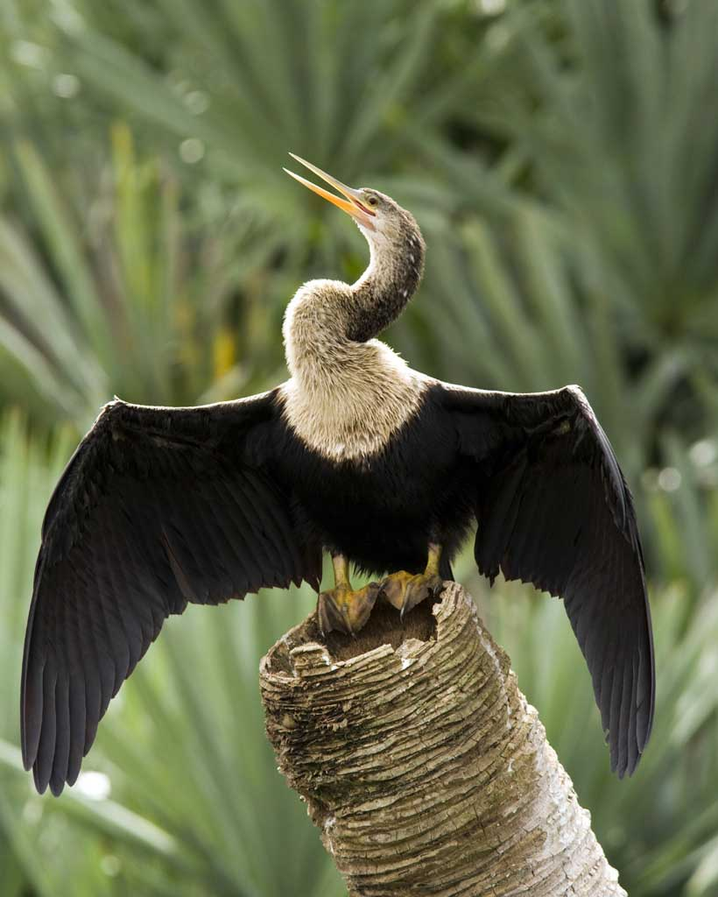

# anhinga

    <h3> A collection of tools for build/layout optimizations for the Magento PWA Studio.</h3>

    

## Docs
- [`babel-plugin-magento-layout`](docs/babel-plugin-magento-layout.md)
- [`extension-aggregator`](docs/extension-aggregator.md)
