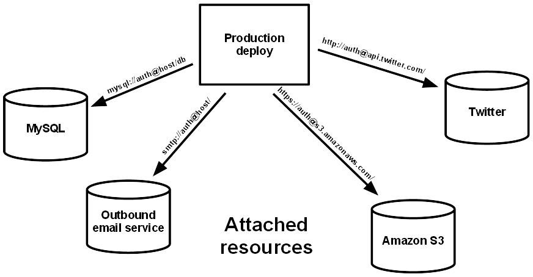
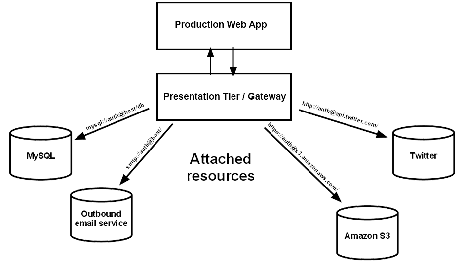
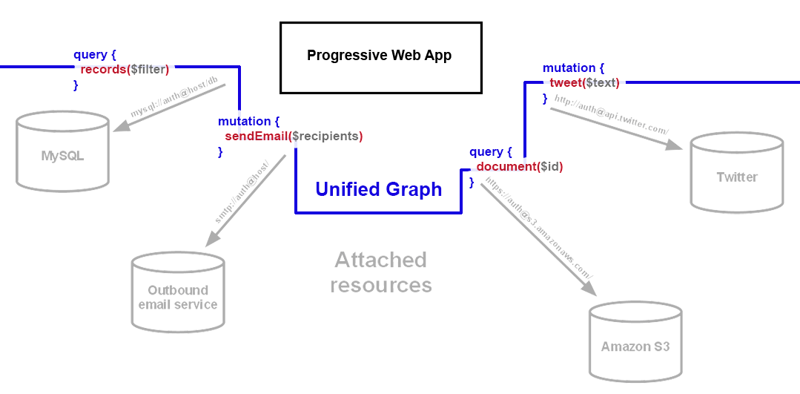

# Rationale: Why UPWARD

- [Rationale: Why UPWARD](#rationale-why-upward)
  - [The Problem With PWA Runtime Dependencies](#the-problem-with-pwa-runtime-dependencies)
    - [Tiered Architectures](#tiered-architectures)
    - [Edge Definition, Not Service Orchestration](#edge-definition-not-service-orchestration)
    - [Common PWA Backing Service Characteristics](#common-pwa-backing-service-characteristics)
  - [UPWARD with PWAs](#upward-with-pwas)
    - [Enforce stateless middle tiers](#enforce-stateless-middle-tiers)
      - [Example `upward.yml`](#example-upwardyml)
      - [Push business logic to the edges of the system](#push-business-logic-to-the-edges-of-the-system)
  - [Objections](#objections)

Progressive Web Apps represent a new plateau of maturity for the Web as a platform. Like any other high-quality software, PWAs benefit from [Twelve-factor methodology][twelve factor], but they have historically been considered a _part_ of a full-scale deployed application, the "frontend", and not a full application to which all twelve-factor principles should apply.

Until PWAs, "web apps" have not been apps on their own; they could not function without a specific set of backing services. Those services should be decoupled and abstracted as [resource locators][twelve factor resources], so that individual servers can be swapped in and out, but the "frontend" is still tightly coupled to a specific topology of services, culminating in end-to-end functionality that depends on all of those services being present.


_Image courtesy of 12factor.net_

A PWA must run independently from any backing services as much as possible; therefore, it must have alternate strategies to replace the functionality of each backing service. The simplest and most efficient PWA would have as few individual backing services as possible, so a need emerges for a tool which unifies backing services into a single layer that deliver, supports, and synchronizes with a PWA.

## The Problem With PWA Runtime Dependencies

A PWA must have at least partial functionality offline; for example, an eCommerce store PWA should be able to navigate its catalog in several dimensions, including categories and configurable products, without placing a server call for each transition. Therefore, at least some of its business logic must be implemented in the HTML/CSS/JS layer traditionally designated as "frontend".

However, duplication of logic is an antipattern, and the spreading of business logic across multiple layers is an antipattern that harms testability. The [ports and adapters architecture, or "hexagonal" architecture,][hexagonal architecture] describes how business logic must be confined to the center of the architecture, and expressed or interpreted through a small number of adapters, so that it can be connected with backing services and tested in multiple contexts.

This seems incompatible with an app architecture that supports "offline mode", where workflows should be independent of the availability of services. Since business logic must be in the center and accessible through ports, it follows that a Web app should move its "center" of authoritative business logic to the frontend, or as close to the frontend as possible.

This is a difficult migration path for many web apps, for many reasons: security concerns, scalability concerns about the JavaScript language and runtime, and the value inherent in existing codebases. Yet as more Web apps implement offline functionality, pressure increases on their business logic to duplicate and/or spread out across platforms in a dangerously coupled way. **A robust architecture must provide natural and obvious locations for different types of business logic.** Without them, an application will amass implicit, undocumented, informal business logic in one or more places.

### Tiered Architectures

The most frequently used solution to the problem of PWA runtime dependencies is a [multitier architecture][multitier architecture], using some combination of:

- a "presentation tier" or "[backend-for-frontend][backend-for-frontend]" for serving the app assets and reverse proxying to services
- a "middle tier" or "[gateway][gateway aggregation]" for combining related service requests.

In both of those cases, the intermediaries serve as a gathering point for the frontend:



However, these tiers are almost implemented in a **general-purpose web framework**, written in a **general-purpose programming language**. The hazard always exists for an implementer to "cheat" the architecture, and fix a bug in either the production web app, or one of the attached services, in the presentation tier!

A declarative middle tier architecture is called for. Early efforts to standardize a format for [service discovery][uddi], as well as more recent efforts to standardize a format for [service topology][tosca], have resulted in complex and overspecified configurations most useful in closed systems.

### Edge Definition, Not Service Orchestration

A common solution to the problem of business logic that exists across multiple services is [service orchestration][service orchestration], but a service orchestrator is a separate program with foreknowledge of the workflows that exist, and an imperative programming paradigm that enforces the workflows. UPWARD more closely resembles [service choreography][service choreography]; an UPWARD configuration has global control over a request, rather than control from a specific node in the network. This simplification is possible because UPWARD is for a PWA [application shell][application shell], so it needs to respond to a more restricted set of conditions than some other service architectures.

### Common PWA Backing Service Characteristics

PWA best practices recommend a small subset of the possible things a web server can do. This set of restrictions makes it much easier to describe web server behavior with a limited set of definitions.

A PWA should:

- Serve over [HTTPS only][pwa https]
- Serve an [application shell][application shell] with some aspects common to all pages
- Serve static resources from [edge servers][cdn def] whenever possible
- Provide a common strategy for data exchange, such as GraphQL, to avoid excess client responsibilities
- Consume data from as few conceptual domains as possible

A PWA should not:

- Require many resources that cannot be [cached and reused when offline][offline mode]
- Depend on server-side state for [most interactions and workflows][high perf loading]
- Depend on a particular backing technology stack

It follows that a server which delivers PWA resources can count on the following to be true:

- Requests are idempotent
- Responses are small
- All services are GraphQL

These assumptions enable a manageably small declarative specification for an app shell server.

## UPWARD with PWAs

The UPWARD specification enables developers and administrators to describe a middle tier and/or backend-for-frontend architecture that cannot include arbitrary business logic, since its behavior is confined to the declarative specification.

### Enforce stateless middle tiers

The following configuration file defines a middle tier server that renders a simple application shell, using different templates based on pattern-matching conditions. It cannot maintain any local state. It cannot, and does not need to, do any significant rule-based data transformation beyond pattern matches.

#### Example `upward.yml`

```yaml
status: page.status
headers: page.headers
body: page.body

articleResult:
  url: env.LIBRARY_SVC
  query: './getArticle.graphql'
  variables:
    articleId: request.url.query.artID

authorBioResult:
  url: env.LIBRARY_SVC
  query: './getAuthor.graphql'
  variables:
    searchTerm: request.url.query.authorID

textHtml:
  inline:
    'content-type': 'text/html'

notFound:
  inline:
    status: 404
    headers: textHtml
    body:
      engine: mustache
      template: './notFound.mst'

page:
  when:
    - matches: request.url.pathname
      pattern: '/article'
      use:
        when:
          - matches: articleResult.data.article.id
            pattern: '.'
            use:
              inline:
                status: 200
                headers: textHtml
                body:
                  engine: mustache
                  template: './article.mst'
        default: notFound
    - matches: request.url.pathname
      pattern: '/author'
      use:
        when:
          - matches: authorBioResult.data.author.id
            pattern: '.'
            use:
              inline:
                status: 200
                headers: textHtml
                body:
                  engine: mustache
                  template: './authorBio.mst'
        default: notFound
  default: notFound
```

The `LIBRARY_SVC` endpoint is responsible for providing, querying, and doing existence checks on the backing data. The `.mst` template files implement only the base Mustache specification, so they are almost completely logic-free--they don't even have conditionals. A PWA expecting this server can read this document and structure the same GraphQL calls; in this way, a PWA can include an `upward.yml` to define service dependencies, or it can build against a service-provided `upward.yml` to do service discovery.

#### Push business logic to the edges of the system

When an architecture uses an UPWARD server as a middle tier, it can't hide any business logic there. Business logic must be extracted to reusable templates or queries, pushed forward to the frontend, or pushed backward to the backend. When logic duplication must occur, it is pushed to the edges of the system, rather than hiding in the middle of a tiered architecture.

An UPWARD-compliant server is not responsible for caching, proxying, or static assets. Its only responsibility is to unify, in a central format, the requirements and processes that create an application shell for a Progressive Web App, so that both a backend server and a frontend client can use the same cross-platform implementations (such as templates and queries) to perform render.



## Objections

Common objections to creating new specifications and standards include:

- **Necessity**: Unclear what problem the standard solves
- **Proliferation**: Too many standards exist already
- **Restrictiveness**: The standard imposes restrictions that hamper desired functionality
- **Erosion risk**: Ensuring compliance with a standard's updates adds to the cost of software development and maintenance

The UPWARD team shares those concerns, and applies them continuously to the standard as it develops. UPWARD exists because it answers these concerns with clear necessity, wise restrictiveness and limited scope, in this document and in its specification.

[pwa https]: <https://developers.google.com/web/fundamentals/security/encrypt-in-transit/why-https>
[twelve factor]: <https://12factor.net/>
[twelve factor resources]: <https://12factor.net/backing-services>
[application shell]: <https://developers.google.com/web/fundamentals/architecture/app-shell>
[ports and adapters architecture]: <https://spin.atomicobject.com/2013/02/23/ports-adapters-software-architecture/>
[cdn def]: <https://en.wikipedia.org/wiki/Content_delivery_network>
[offline mode]: <https://developers.google.com/web/fundamentals/instant-and-offline/offline-cookbook/>
[high perf loading]: <https://developers.google.com/web/fundamentals/primers/service-workers/high-performance-loading>
[service orchestration]: <https://en.wikipedia.org/wiki/Orchestration_(computing)>
[service choreography]: <https://en.wikipedia.org/wiki/Service_choreography>
[backend-for-frontend]: <https://docs.microsoft.com/en-us/azure/architecture/patterns/backends-for-frontends>
[gateway aggregation]: <https://docs.microsoft.com/en-us/azure/architecture/patterns/gateway-aggregation>
[uddi]: <https://en.wikipedia.org/wiki/Web_Services_Discovery>
[tosca]: <https://en.wikipedia.org/wiki/OASIS_TOSCA>
