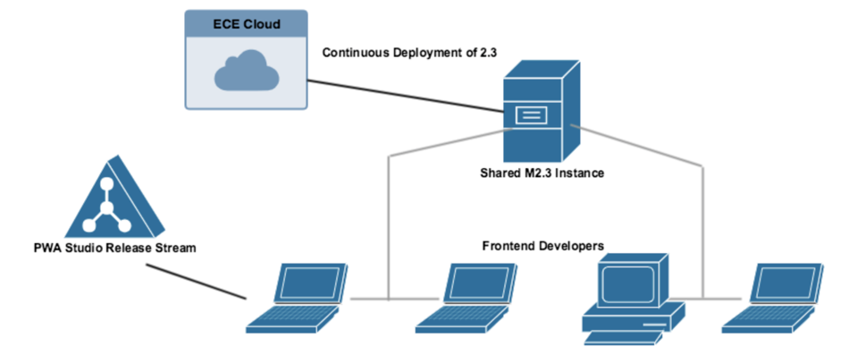

# Why UPWARD for Magento PWA Studio

Magento PWA Studio is meant to be cheap and easy to run; it should not be tied to a specific tech stack. A middle tier server is necessary to decouple PWA Studio from the Magento Theme resolution tier, which requires two-way binding in the filesystem. UPWARD allows us to require this middle tier without requiring a specific tech stack.

## PWA Studio 1.0 and the Theme Architecture

The initial architecture for PWA Studio fit the project files for the JavaScript application, both the view components and the build tooling, into the structure of a Magento Theme. This was chosen for several reasons:

- Existing concepts easier to understand
- Might use today's extensions
- Built-in server side rendering
- Gives power to business users
- Scales up to enterprise and down to SMB

However, big problems soon emerged with this approach. The main theme was that the coupling between PWA Studio and an instance of Magento was too tight. Problems included:

- Difficulty connecting the instance of PWA Studio's theme with an instance of Magento in development
- Difficulty configuring Magento correctly to serve static files, and synchronizing that configuration with PWA Studio
- Discovery of how to precisely configure Magento to render the application shell
- The fundamental one-to-one binding of a Magento store and a Magento theme, preventing multicast
- Server-side rendering strategy that either led to bad SEO or required re-implementation of app shell UI

Perhaps most significantly, there was a great disparity between the structures of the development and production environments. This violation of 12-factor principles meant that any deploy pipeline would be brittle and prone to unexpected failure.

It became clear that a middle tier was necessary to separate Magento PWAs from Magento's existing rendering system, so that the only relationship between the two would be formal API contracts. Several options presented themselves.

### Option 1: Use a NodeJS Server in Production

Since the development server is a NodeJS process, we could recommend that production deployments use a NodeJS middle tier as well.

| Advantages | Disadvantages |
| ---------- | ------------- |
| Similar to development environment | Dissimilar to other Magento production environments
| Fast, proven, and exciting to community | Different process model requires special ops knowledge
| Compatible with move towards distributed architecture | Incompatible with one of the missions of PWA Studio, to give lower-resource merchants and devs access to its features
| Server-side rendering | Isomorphic (server-and-client) React is harder to write and harder to bundle well for PWA

The final decision came down to our reluctance to require the Magento ops and dev communities to master another advanced skill on top of all the others Magento 2 requires: the management of NodeJS process pools in production. 

### Option 2: Use a PHP Script or Magento Module in Development

A custom PHP script, or an actual Magento module, would be easy to set up for the vast majority of today's full stack Magento 2 developers. However, it's a less traditional working style for NodeJS devs, and the tooling might be incompatible.

| Advantages | Disadvantages |
| ---------- | ------------- |
| Familiarity in Magento community | Unfamiliar in greater frontend community |
| Compatible with Cloud | Requires extra PHP setup for many developers |
| Allows for monolithic, single-store deployments to use a PWA | Does not encourage service-oriented architecture |
| Closer to production environment | Incompatible with frontend best practices and tools |

Ultimately, maintaining both NodeJS and PHP in the correct versions for a development environment seemed to be an obstacle to inviting new frontend developers into the Magento ecosystem.

## PWA Studio 2.0 and the UPWARD architecture

UPWARD aims to collect the advantages of the above approaches. It allows for different programming languages and technology stacks in development and production, but it maintains consistency by requiring that the frontend server be UPWARD-compliant and derive its behavior from a file contained in the PWA project. Development and production are more similar as a result.

UPWARD includes advantages from both prior options:

- Supports NodeJS-based middle tier production deployment
- Supports all-PHP distributed architecture if necessary
- Supports monolithic Magento production deployment (pending an UPWARD implementation as an M2 module)
- Supports standard developer tooling with minimal dependencies
- Supports server-side rendering with template language extensibility

In addition, UPWARD provides the following interesting perks:

- In an excellent example of dependency inversion, PWA frontend projects can use an UPWARD file to declare their runtime network expectations, instead of having to develop a PWA around an existing middle tier or API layer
- The forced simplicity of the middle tier, with very little possible logical transformation, discourages implicit and undocumented hacks buried in the middle tier
- YAML files are mergeable, like XML files, so extensibility options are copious
- The new one-way connection from an UPWARD PWA to a Magento theme allows for many developers to use one Magento instance, radically simplifying the frontend dev's setup burden.

More advantages to the UPWARD architecture will appear as it is refined and adopted, and as setbacks occur, we will refine the UPWARD specification in concert with our community.

Progressive Web Apps are unexplored territory for many, and the best practices in the field are mutating very quickly. Like the GraphQL specification, the HTML5 specification before it, and the REST specification before any of them, this represents Magento's effort to help stabilize a technology sphere in which we are one of the first explorers. It may have been slower and more expensive to implement our PWA Studio middle tier as a specification, rather than a custom server, but we believe it will benefit us, our community, and the greater Web developer community for a long time.
