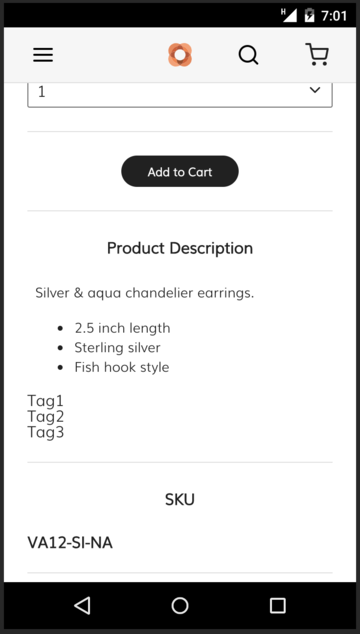
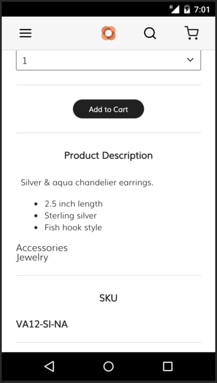
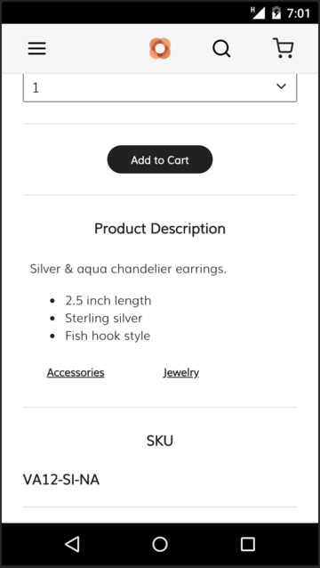
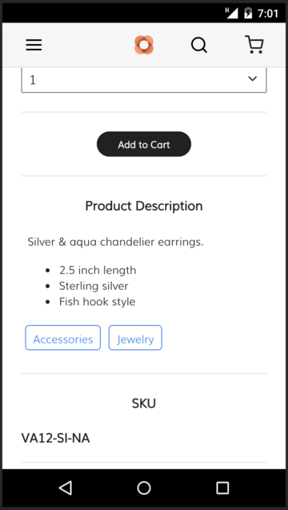

This tutorial provides the steps for creating a tag list component for a storefront.
For this tutorial, the tag list is added to the product details page in the Venia storefront.

## Prerequisites

Before you start this tutorial, make sure you have a storefront development environment set up.

The general steps provided by this tutorial can apply to different kinds of setup, but
the specific details assumes that you followed the steps in the [Venia storefront setup][] topic to set up a storefront for development.

## Step 1. Create component directory and files

Inside your project's directory for components, create a new directory called **TagList**.
In the `pwa-studio` project, this directory is `packages/venia-ui/lib/components`.

Inside the **TagList** directory, create empty files with the following names:

-   `index.js`
-   `tag.css`
-   `tag.js`
-   `tagList.css`
-   `tagList.js`

{: .bs-callout .bs-callout-info}
These names follow the [naming conventions][] used in the `pwa-studio` project.

## Step 2. Define the `Tag` module

The `Tag` module is responible for rendering a single tag in the tag list.

Open the `tag.js` file and add the following content:

```jsx
import React from 'react';

// Use the prop-types module for type checking
import { string } from 'prop-types';

// This is a component responsible for rendering a single tag
const Tag = props => {

    // Destructure the props object into variables
    const { value } = props;

    // Return the tag string inside a list item element
    return <li>{value}</li>;
}

// Define the props this component accepts
Tag.propTypes = {
    value: string
}

// Make this function the default exported of this module
export default Tag;
```

## Step 3. Define the `TagList` module

The `TagList` module accepts an array of strings and returns a `div` container with a list of tags.
This module is the default module exported by the `index.js` file.

Open the `tagList.js` file and add the following content:

```jsx
import React from 'react';

import { arrayOf, string } from 'prop-types';

// Import the previously defined Tag component
import Tag from './tag';

// This is the main tag list component
const TagList = props => {

    // Destructure the props object into variables
    const { tagArray } = props;

    // Convert the array of tag strings into a list of Tag components
    const tagList = tagArray.map(value => {
        return <Tag key={value} value={value} />;
    })

    // Returns the list of Tag components inside a ul container
    return <ul>{tagList}</ul>;
}

TagList.propTypes = {
    // tagArray is expected to be an array of strings
    tagArray: arrayOf(string)
}

export default TagList;
```

## Step 4. Expose the module's public API

Open the component's `index.js` file and add the following content:

```js
export { default } from './tagList';
```

Exporting modules from your component's `index.js` file is a commond standard in a React project.
It allows a component to import this component using its directory name.

## Step 5. Add component to the product details page

Find the component that renders the product details page in your storefront project and insert the TagList component into the page.

In the `pwa-studio` project, this component is defined in the following file:

```text
packages/venia-ui/lib/components/ProductFullDetail/productFullDetail.js
```

At the top of this file, import the TagList component:

```jsx
import TagList from '../TagList';
```

If you are using the default Venia ProductFullDetail component you can insert TagList into the **Product Description** section:

```diff
 <section className={classes.description}>
     <h2 className={classes.descriptionTitle}>
         Product Description
     </h2>
     <RichText content={productDetails.description} />
+    <TagList tagArray={['Tag1', 'Tag2', 'Tag3']} />
 </section>
```

Now, when you visit a product detail page, it will show a list with the hard coded strings.



## Step 6. Connect to real product data

To make this component useful, it needs to show actual product-specific data.
Clicking each tag should display other similarly tagged items.

For this tutorial, the TagList component will list the product's categories.

### Edit the GraphQL query

Venia's ProductFullDetail component gets the product data from the GraphQL query defined in:

```text
packages/venia-ui/lib/queries/getProductDetail.graphql
```

Edit the `categories` entry for this query and add the following:

```diff
 categories {
     id
     breadcrumbs {
         category_uid
     }
+    name
+    url_path
 }
```

Appending this to the query adds a `categories` object to the returned data.
This object contains information on the name and URL paths for each category.

### Pass the categories data into the TagList component

Open the file for the product detail component and update the code:

```diff
 <section className={classes.description}>
     <h2 className={classes.descriptionTitle}>
         Product Description
     </h2>
     <RichText content={productDetails.description} />
-    <TagList tagArray={['Tag1', 'Tag2', 'Tag3']} />
+    <TagList categories={product.categories} />
 </section>
```

This replaces the hard coded data with actual product-specific data, but
now, the `tagArray` prop has been replaced with a `categories` prop that the component does not know how to handle.

### Update TagList

Open `tagList.js` and update the component to accept the new `categories` prop:

```diff
 import React from 'react';
 
-import { arrayOf, string } from 'prop-types';
+import { arrayOf, shape, string } from 'prop-types';
 
 // Import the previously defined Tag component
 import Tag from './tag';
 
 // This is the main tag list module
 const TagList = props => {
 
     // Destructure the props object into variables
-    const { tagArray } = props;
+    const { categories } = props;
 
-    // Convert the array of tag strings into a list of Tag components
-    const tagList = tagArray.map(value => {
-        return <Tag key={value} value={value} />;
+    // Convert the array of category objects into a list of Tag components
+    const tagList = categories.map(keyword => {
+        return <Tag key={keyword.name} value={keyword.name} />;
     })
 
     // Returns the list of Tag components inside a div container
     return <ul>{tagList}</ul>;
 }
 
 TagList.propTypes = {
-    // tagArray is expected to be an array of strings
-    tagArray: arrayOf(string)
+    // categories is expected to be an object with a name and url_path string properties
+    categories: arrayOf(
+       shape({
+           name: string.isRequired,
+           url_path: string.isRequired
+       })
+    )   
 }
 
 export default TagList;
```

Now, when you load the product details page, it lists the categories for that specific product:



## Step 7. Incorporate other Venia components

Tags often look like buttons and provide a way to view other items that have the same tag when clicked.
Use the components provided by the PWA Studio libraries to add this feature.

### Update Tag component

Open `tag.js` and update the component to use existing Venia components:

```diff
 import React from 'react';
+import Button from '../Button';
+import { Link } from '@magento/venia-drivers';

 // Use the prop-types module for type checking
-import { string } from 'prop-types';
+import { string, shape } from 'prop-types';
 
+const categoryUrlSuffix = '.html';

 // This is a module responsible for rendering a single tag
 const Tag = props => {
 
     // Destructure the props object into variables
     const { value } = props;
 
+    const { name, url_path } = value;
+    const url = `/${url_path}${categoryUrlSuffix}`;
 
-    // Return the tag string inside a list item element
-    return <li>{value}</li>;
+    // Return the tag as a Link component wrapped around a Button
+    return (
+        <Link to={url}>
+            <Button priority="low" type="button">
+                {name}
+            </Button>
+        </Link>
+    );
 }
 
 // Define the props this component accepts
 Tag.propTypes = {
-    value: string
+    value: shape({
+       name: string.isRequired,
+       url_path: string.isRequired
+    })
 }
 
 // Make this function the default exported module for this file
 export default Tag;
```

This update imports existing PWA Studio components and uses them to compose a tag button that acts as a link.

### Update TagList component

Since the Tag component no longer returns the tag inside a list item element, the TagList component needs to be updated to pass in the keyword object and replace the `ul` container with a `div` container:

```diff
-const tagList = categories.map(keyword => {
-    return <Tag key={keyword.name} value={keyword.name} />;
+const tagList = categories.map(category => {
+    return <Tag key={category.name} value={category} />;
 });
-return <ul>{tagList}</ul>
+return <div>{tagList}</div>
```

Now, when you open the product detail page, you see the tags listed horizontally and clicking on one takes you to that category's page.



## Step 8. Style the components

With the click functionality in place, the last step is to add custom styles to make the tags stand out.

### Define the TagList style

A product can fall into multiple categories, so
the TagList style must accomodate for any number of categories.

#### `tagList.css`

Open the `tagList.css` file and add the following content:

```css
.root {
    display: flex;
    flex-wrap: wrap;
}
```

This entry defines the root container of a TagList component as a [flexbox][] that wraps.
This prevents the Tags from overflowing off the side of the page.

#### `tagList.js`

Open the `tagList.js` file and make the following changes to the component.

**Change 1:** Import the `useStyle()` hook and the `tagList.css` file:

```diff
 import { arrayOf, shape, string } from 'prop-types';
 
+import { useStyle } from '../../classify';
+import defaultClasses from './tagList.css';
 
 import Tag from './tag';
```

**Change 2:** Use the `useStyle()` hook to merge custom classes passed into the component:

```diff
 const { categories } = props;
 
+const classes = useStyle(defaultClasses, props.classes);
```

{: .bs-callout .bs-callout-info}
The `useStyle()` function is used for merging a component's default classes with custom class overrides.

**Change 3:** Set the `className` property of the `div` container to the `root` class:

```diff
-return <div>{tagList}</div>
+return <div className={classes.root}>{tagList}</div>
```

**Change 4:** Update the prop types with classes:

```diff
 TagList.propTypes = {
     // tagArray is expected to be an array of strings
     tagArray: arrayOf(string)
+    classes: shape({
+        root: string
+    })
 }
```

### Define the Tag styles

Tags need to stand out from the surrounding text and look button-like.

#### `tag.css`

Open the `tag.css` file and add the following content:

```css
.root {
    border: solid 1px #2680eb;
    padding: 3px 9px;
    margin: 5px;
    border-radius: 5px;
}

.content {
    color: #2680eb;
    font-size: 0.875rem;
}
```

#### `tag.js`

Open the `tag.js` file and make the following changes to the component.

**Change 1:** Import the `useStyle()` hook and the `tag.css` file:

```diff
 import Button from '../Button';
+import { useStyle } from '../../classify';
+import defaultClasses from './tag.css';
 import { Link } from '@magento/venia-drivers';
```

**Change 2:** Use the `useStyle()` hook to merge custom classes passed into the component and create a new `buttonClasses` object:

```diff
 const { value } = props;
 
+const classes = useStyle(defaultClasses, props.classes);
+
+const buttonClasses = {
+    root_lowPriority: classes.root,
+    content: classes.content
+};
```

The `buttonClasses` object is used to override the styles in the Button component.
The component expects a specific shape for the `classes` prop that the `buttonClasses` object fits.

**Change 3:** Set the styles for the Link and Button component:

```diff
 return (
-    <Link to={url}>
-        <Button priority="low" type="button">
-            {name}
-        </Button>
-    </Link>
+   <Link className={classes.link} to={url}>
+       <Button classes={buttonClasses} priority="low" type="button">
+           {name}
+       </Button>
+   </Link>
 );
```

## Congratulations

You just created a new storefront components using PWA Studio libraries and conventions.



[venia storefront setup]: <>

[naming conventions]: https://github.com/magento/pwa-studio/wiki/Project-coding-standards-and-conventions#file-naming-and-directory-structure

[flexbox]: https://developer.mozilla.org/en-US/docs/Web/CSS/CSS_Flexible_Box_Layout/Basic_Concepts_of_Flexbox
