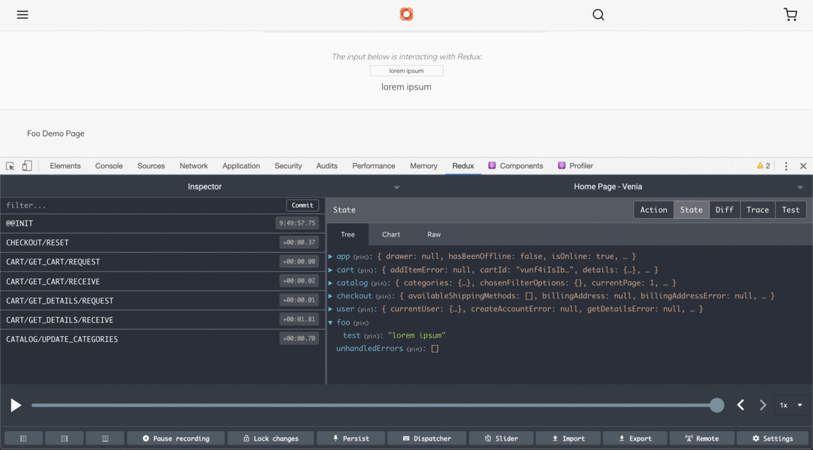

## Overview

PWA Studio uses Redux to manage the application state. 
If you're not familiar with Redux you should see the [Learn More][] section and 
do some of your own research online so you have basic understanding of it.  

In this tutorial we will demonstrate how you can work with Redux and PWA Studio together, 
and combine Redux Reducers from the @magento/perigrine library with your own.

_Note: Recent versions of PWA Studio now also use React Hooks to manage state._

### Introduction

First lets look at how PWA Studio uses Redux by installing the [Redux DevTools][] extension for Chrome.  
Once you have it installed, browse to the [Venia storefront][] and explore what it has in it's Redux Store.
![redux store in devtools][]

Next explore the following files & directories in your project.

1.  _src/store.js_  
    This file is responsible for creating a Redux store. It also combines Redux reducers and middlewares.
1.  _node_modules/@magento/peregrine/lib/store/reducers_  
    Each file in this directory contains a reducer that manages a specific part of the application state.
    A reducer updates the application state given the current state and an action object.
1.  _node_modules/@magento/peregrine/lib/store/actions_  
    This directory contains all Redux action creator definitions. 
    The files in this directory group the action creators together based on the application feature they affect.
1.  _node_modules/@magento/peregrine/lib/store/middleware_  
    This directory contains a Redux middleware for development that logs dispatched actions and updated state to the browser console. 
    This functionality adheres to the [Redux middleware pattern][].

### Add to The Redux Store

Create the file below to add a value to the redux store.

_src/reducers/foo.js_

```javascript
import { handleActions } from 'redux-actions';

import actions from '@magento/peregrine/lib/store/actions/app'; // we'll use these actions for now, and create our own one later

export const name = 'foo';

const initialState = {
  test: 'lorem ipsum'
};

const reducerMap = {
  [actions.toggleDrawer]: (state, { payload }) => {
    return {
      ...state,
      test: payload
    };
  }
};

export default handleActions(reducerMap, initialState);
```

Pay note of [handleActions][] which replaces the traditional [switch statement][] often used in Reducers.
Also, we are not using a custom `action` yet, for now we are using the `APP` from the _@magento/peregrine_ library.

Next Create the following file...

_src/reducers/index.js_

```javascript
import foo from './foo';

const reducers = {
  foo
};

export default reducers;
```

Next in your applications _src/store.js_ file update the `import` statements to include your local _reducers_ and combine them with the _reducers_ from @magento/peregrine:

```javascript
import { combineReducers, createStore } from 'redux';
import { enhancer, reducers } from '@magento/peregrine';
import myReducers from './reducers';

const rootReducer = combineReducers({ ...reducers, ...myReducers });

export default createStore(rootReducer, enhancer);
```

Now check to the  storefront and you should be able to see foo.test added to the Redux State, open & close the navigation menu and it should update.
![foo in the redux store][]

### Get from the Redux Store

We'll display the foo.test value we set in the Redux store in the Foo component we created in a previous tutorial.  

Open the _src/components/Foo/Foo.js_ file and add the following import.

```javascript
import { connect } from 'react-redux';
```

Now to map the state from redux to your component's `props` replace the export statement with the following:

```javascript
const mapStateToProps = ({ foo }) => ({ foo });
export default connect(mapStateToProps)(Foo);
```

And lets assign `props.foo` to a `foo` constant in the _Foo.js_ component.

```javascript
// other code
const Foo = props => {
  const { foo } = props;
  const classes = useStyle(defaultClasses, props.classes);
  const [nameText, setNameText] = useState('');
  // other code
```

And add the following to your JSX:

```jsx
<p>{foo.test}</p>
```

Browse to _/foo.html_ to see _"lorem ipsum"_ you have added to the redux store.

### Update The Redux Store

#### Created an Action

To update the Redux store we first need to add a [redux action][].

Add the following files...

_src/actions/foo/actions.js_

```javascript
import { createActions } from 'redux-actions';

const prefix = 'FOO';
const actionTypes = [
  'UPDATE_TEST'
];

export default createActions(...actionTypes, { prefix });
```

_src/actions/foo/asyncActions.js_

```javascript
import actions from './actions';
 
export const updateTest = value => async dispatch =>
    dispatch(actions.updateTest(value));
```

_src/actions/foo/index.js_

```javascript
export { default } from './actions';
export * from './asyncActions';
```

**NOTE:** PWA Studio uses:

-   [createActions][] to create multiple actions at once.
-   [async actions][] which are useful when API responses update the redux store.

#### Update the Reducer with the New Action

Now that we have our redux action created add it to our reducer, 
go to _src/reducers/foo.js_ and change the `import actions` statement to:  

```javascript
import actions from 'src/actions/foo';
```

And in the `reducerMap` change `actions.toggleDrawer` to `actions.updateTest`.

#### Create a component to update the Redux Store

Next we'll create a new child component which will use the action above to update the redux store.

_src/components/Foo/updateRedux.js_

```javascript
import React from 'react';
import { connect } from 'react-redux';
import { compose } from 'redux';
import { PropTypes } from 'prop-types';
import { updateTest } from 'src/actions/foo';

const updateRedux = props => {
  const { test, updateTest } = props;

  return (
    <input type="text" value={test} onChange={updateTest} style={{ textAlign: 'center' }} />
  );
}

updateRedux.propTypes = {
  test: PropTypes.string,
  updateTest: PropTypes.func.isRequired
};

const mapDispatchToProps = dispatch => ({
  updateTest: (e) => dispatch(updateTest(e.target.value))
});

export default compose(
  connect(
    null,
    mapDispatchToProps
  )
)(updateRedux);
```

Import the above component to the _Foo.js_ Component.  

```javascript   
import UpdateRedux from './updateRedux';
```

And add it to the JSX:  

```jsx
<hr className={classes.spacer} />
<p className={classes.label}>The input below is interacting with Redux:</p>
<UpdateRedux test={foo.test} />
<p style={{ marginTop: 10 }}>{foo.test}</p>
```

Now test it by typing into the new input box while checking Redux dev tools to see the value in the Redux store update.



## Learn More

-   [Getting Started with Redux][]

[Getting Started with Redux]: https://redux.js.org/introduction/getting-started
[Learn More]: #learn-more
[Redux DevTools]: https://chrome.google.com/webstore/detail/redux-devtools/lmhkpmbekcpmknklioeibfkpmmfibljd
[Venia storefront]: https://venia.magento.com/
[handleActions]: https://redux-actions.js.org/api/handleaction
[switch statement]: https://redux.js.org/basics/reducers#handling-more-actions
[redux action]: https://redux.js.org/basics/actions
[createActions]: https://redux-actions.js.org/api/createaction
[async actions]: https://redux.js.org/advanced/async-actions#async-actions
[Redux middleware pattern]: https://redux.js.org/advanced/middleware/
[redux store in devtools]: ./images/redux-store-screenshot.png
[foo in the redux store]: ./images/foo-in-the-redux-store.gif
[foo redux actions]: ./images/foo-redux-actions.gif
