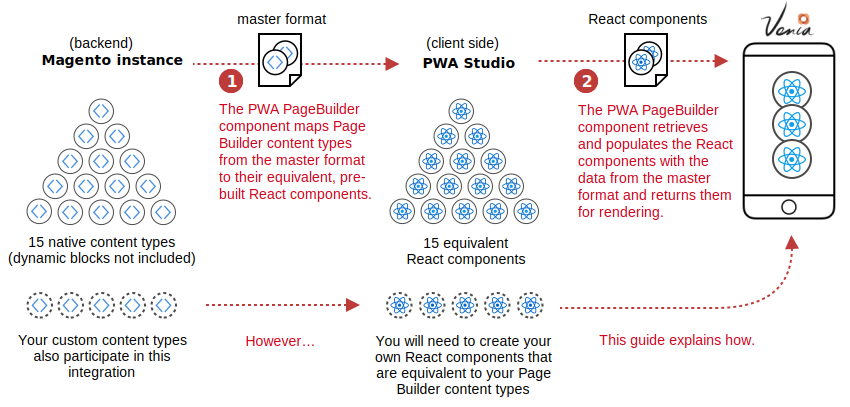
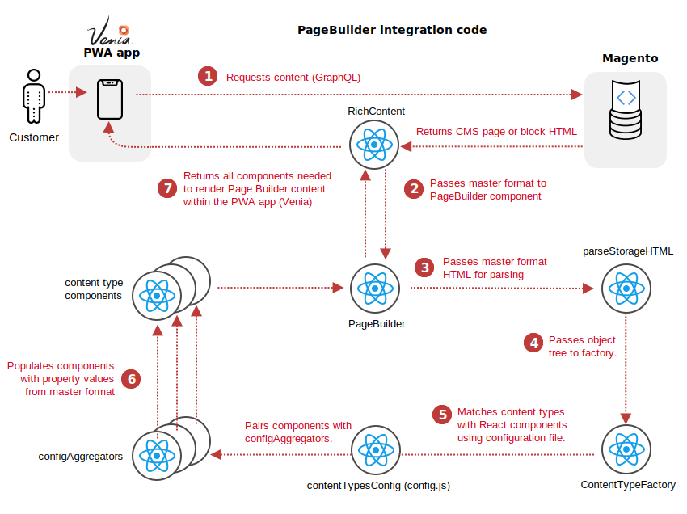

Page Builder integrates into PWA studio by providing React components that are equivalent to the Magento Page Builder content types. It then populates those components with the data from the master format HTML. Here is a visualization of this process:

## Detailed flow

As part of the Page Builder / PWA integration, we implemented a system in which we can convert Page Builder's master format into a structured format that React and PWA Studio could understand. We did this on the client side to ensure compatibility with all various hosting methods of Magento Commerce currently available. The flow diagram starts with a customer interacting with the Venia PWA app. 

1. The Venia app uses a GraphQL query to get CMS content from your Magento store (pages and blocks) and passes the HTML to the `RichContent` component to begin processing.
2. The `RichContent` component determines if the HTML contains Page Builder content, using simple pattern recognition. If the HTML does not include Page Builder content, it is returned to Venia and rendered out as is. If the HTML does include Page Builder content, the HTML (master format) is passed to the `PageBuilder` component.
3. The `PageBuilder` component passes the master format HTML to the `parseStorageHTML` function.
4. The `parseStorageHtml` function uses a `TreeWalker` to parse all nodes within the master format and create an object tree of all the content types with their associated data. The object tree is passed to the `ContentTypeFactory`.
5. For each content type within the object tree, the `ContentTypeFactory` requests the React component and its `configAggregator` from the `contentTypeConfiguration`(the directory of valid content types).
6. The `configAggregator` for each Page Builder component populates the component with the property values collected from the master format.
7. The `PageBuilder` component returns all the components needed to render the Page Builder content within the PWA app.
