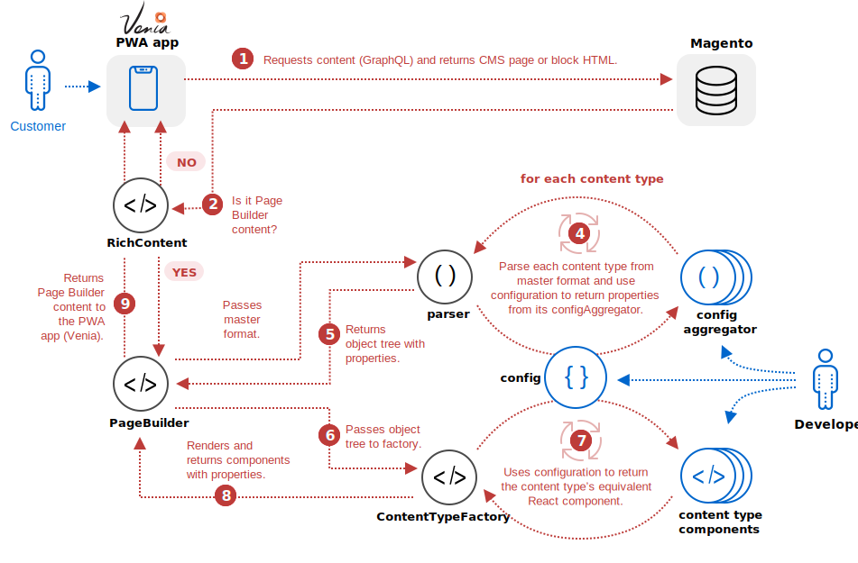

The purpose of the Page Builder to PWA integration is to retrieve data from the Page Builder content types and push that data into equivalent React components for display in a PWA app. The Page Builder framework populates the React components with the properties extracted from the master format HTML, then renders those components to the PWA Studio's Venia app. A visualization of this process follows:

## Page Builder PWA framework

As part of the Page Builder to PWA integration, we implemented a framework that converts Page Builder’s master format (HTML) into a structured format that works in React and PWA Studio. The key parts of the framework are described as follows:

**RichContent**: The `<RichContent />` component provides the entry point into the Page Builder PWA framework. It controls whether the HTML passed by the PWA app contains Page Builder content. If it does, the HTML is sent to the `<PageBuilder />` component for processing. If not, the HTML is sent directly to the PWA app for display.

**PageBuilder**: The `<PageBuilder />` component directs the parsing of the master format HTML as well as retrieving, populating, and returning content type components back to the Venia app.

**Master Format parser**: The master format parser function (`parseStorageHtml()`) decomposes the master format HTML into the content type HTML fragments (HTMLElements) that compose the master format. The parser sends the content type HTML to the correct property aggregator (`configAggregator`) using the configuration object.

**Configuration object**: The configuration object (`contentTypesConfig`) provides a kind of registry with a function for retrieving a content type's property aggregator and corresponding Page Builder component. The configuration object provides the integration point for your own custom content type components. See [Set up component][] for details.

**Content Type Aggregator** (extension point): The content type aggregator (`configAggregator`) is a function that retrieves content and style properties from the content type HTML (using DOM properties and framework utility functions). These properties are returned as a flat object for use within the content type component. You will need to create an aggregator for each of your own custom content types. See [Add aggregator][] for details.

**Content Type Component** (extension point): The content type component is a React component that is equivalent to a Page Builder content type. It contains the content and style properties needed to faithfully represent your Page Builder content types within a PWA Studio app like Venia. You will need to create a content type component for each of your own custom content types. See [Add component][] for details.

**ContentTypeFactory**: The `<ContentTypeFactory />` component retrieves and returns content type components to the PWA Studio app for rendering to the end-user.

## How it works

The framework executes on the client side to ensure compatibility with the various hosting options available for Magento Commerce. The following flow diagram describes how the parts of the framework work together to render Page Builder components within the Venia app.

1.  The Venia app uses a GraphQL query to get CMS content from your Magento store (pages and blocks) and passes the HTML to the `<RichContent />` component to begin processing.
2.  The `<RichContent />` component determines if the HTML contains Page Builder content, using simple pattern recognition. If the HTML does not include Page Builder content, it is returned to Venia and rendered out as is. If the HTML does include Page Builder content, the HTML (master format) is passed to the `<PageBuilder />` component.
3.  The `<PageBuilder />` component passes the master format HTML to the `parseStorageHTML()` function.
4.  For each content type within the master format, the `parseStorageHtml()` function use the `contentTypeConfiguration` to call the content type's configAggregator create an object tree of all the content types and associated properties.
5.  The `parseStorageHtml` returns the content type object tree to the `PageBuilder` component.
6.  The `PageBuilder` component passes the object tree to the `ContentTypeFactory`.
7.  For each content type within the object tree, the `ContentTypeFactory` retrieves the React component from the `contentTypeConfiguration`.
8.  The `ContentTypeFactory` populates and renders the component with the property values retrieved by the `parseStorageHtml` from the `configAggregator`.
9.  The `PageBuilder` component returns all the components needed to render the Page Builder content within the PWA app.

[add aggregator]: <{{ site.baseurl }}>
[set up component]: <{{ site.baseurl }}>
[add component]: <{{ site.baseurl }}>
