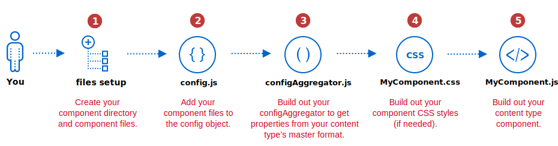

This topic describes how to create a custom Page Builder content type component by decomposing the master format for use in PWA Studio as a React component.

## Prerequisites

- Have PWA Studio setup and running in your development environment.
- Have a working Page Builder custom content type, with the master format implemented.
- Be able to render your content type within a Magento instance using a Luma store front.

## Steps



### Step 1: Create component directory and files

As we require some additional steps compared to a normal we have some additional files associated with each content type, in example our `Text` content types component structure looks like the following:

- `packages/venia-ui/lib/components/RichContent/PageBuilder/ContentTypes/Text`
  - `__tests__`
  - `configAggregator.js`
  - `index.js`
  - `exampleQuote.css`
  - `exampleQuote.js`

`__tests__` & `index.js` are just part of PWA Studio, and won't be discussed here.

### Step 2: Add configAggregator and component to config.js

We currently maintain a static config object called `config.js`. This object defines the content types that are supported. To include support for your custom content type component, you'll need to add an entry to `packages/venia-ui/lib/components/RichContent/PageBuilder/config.js`.

Each entry has to define its `configAggregator` & `component`. Here's an example of the `ExampleQuote` content type's entry in the `config.js` file:

```js
import exampleQuoteConfigAggregator from './ContentTypes/ExampleQuote/configAggregator';

export const contentTypesConfig = {
    ...
    example_quote: {
        configAggregator: exampleQuoteConfigAggregator,
        component: React.lazy(() => import('./ContentTypes/ExampleQuote'))
    }
    ...
};
```

### Step 3: Build out your configAggregator

The config aggregator provides an interface which accepts the HTML master format for a specific content type, decomposes it, and returns it as a flat object of the properties associated with the content type.

The interface for a `configAggregator` is as follows:

```ts
(node: HTMLElement, props: {contentType: string, appearance: string}) => {[key: string]: any}
```

We aim to have human friendly output from the configuration aggregator, where the keys will align with your content types component later on.

We provide a number of utility methods which help with retrieving commonly stored data, such as the advanced section and background images. These are all located within `packages/venia-ui/lib/components/RichContent/PageBuilder/utils.js`. We provide the following utilities, which all accept the `node` passed to the config aggregator:

- `getBackgroundImages`
- `getVerticalAlignment`
- `getAdvanced` _If all advanced items are on the same node you can utilise our wrapper function, otherwise you'll want to use the below individual methods on the correct nodes_.
  - `getPadding`
  - `getMargin`
  - `getBorder`
  - `getTextAlign`
  - `getCssClasses`

For instance our Text content type aggregator looks like the following:

```js
import { getAdvanced } from '../../utils';

export default node => {
    return {
        content: node.innerHTML,
        ...getAdvanced(node)
    };
};
```

The only piece of data the Text content type implements in the admin, apart from our advanced section, is a content field. We utilize DOM functions (such as `innerHTML` and `textContent`) to retrieve the data from the master format and return it. We use the field names from the Page Builder admin form for the keys within the config aggregators response to easily identify the data in the component.

**Tip:** Placing a `console.log(node)` at the top of the `configAggregator` during development can help identify where data lives within the master format.

#### Retrieving data from different Appearances

Some content types have different appearances and thus differences in their master format output. This occurs already within our core Row content type. To handle this we provide the appearance within the second `props` argument to allow you to modify your queries in order to retrieve data from the current node.

For example in Row, we swap the main node we detect based on the appearance:

```js
export default (node, props) => {
    // Determine which node holds the data for the appearance
    const dataNode =
        props.appearance === 'contained' ? node.childNodes[0] : node;
```

### Step 4: Build out your CSS styles

Your `<ContentType>.css` file contains all the CSS styles you need to style your component within a PWA app. Styling your Page Builder components is the same as styling all other components in PWA Studio.

### Step 5: Build out your component

Page Builder React components are the same as working with other React components in PWA Studio. However, the properties defined within a Page Builder component are determined by the properties returned from your configuration aggregator. This may result a larger number of props than usual. But not all props are used when the component is initialized. As a result, you need to ensure if a value is null the component can still render correctly. Here is an example of the properties defined in the `exampleQuote.js`.

```js
const ExampleQuote = props => {
    const {
        quote,
        author,
        description,
        textAlign,
        border,
        borderColor,
        borderWidth,
        borderRadius,
        marginTop,
        marginRight,
        marginBottom,
        marginLeft,
        paddingTop,
        paddingRight,
        paddingBottom,
        paddingLeft,
        cssClasses = []
    } = props;
```

#### Lazy loading components

When building PWAs, performance is key. That's why we recommend loading less critical components using `React.lazy`. This will result in a very slight delay in that content rendering but will ensure we don't bloat the bundle size for the store.

By default, we apply `React.lazy` to the following content types: Banner, Slider, Slide Item, Tab, Tab Item, Button, Button Item, Block, Products, HTML, and Divider.

To have your component loaded lazily you simply have to wrap your `component` reference in a call to `React.lazy` as previously shown for the ExampleQuote component:

```js
component: React.lazy(() => import('./ContentTypes/ExampleQuote'))
```

## Debugging tips

If you haven't yet modified the config object and setup the references you'll see the following console warning in your console to inform you the component is missing:

```text
parseStorageHtml.js?4091:67 No config aggregator defined for content type X, this content type won't be rendered.
```

If you _have_ modified the configuration and your content type is still not displaying you can debug through `packages/venia-ui/lib/components/RichContent/PageBuilder/parseStorageHtml.js` to determine if your configuration item is being correctly detected.
