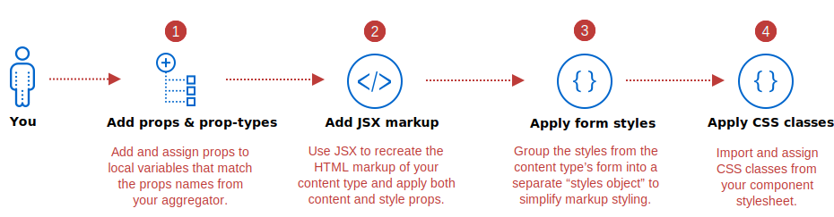
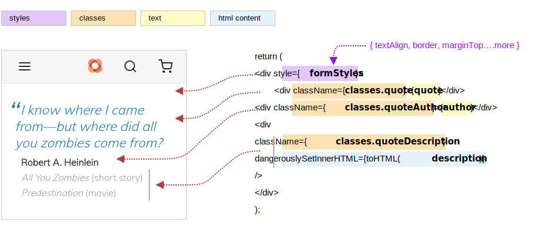

The purpose of a Page Builder component is to recreate a Page Builder content type (from your Magento instance) to display inside a PWA app. Developing this component is similar to developing other React components in PWA Studio. However, the properties defined within a Page Builder component are determined by the properties returned from your configuration aggregator. The following steps highlight how to put these properties to use in your component:



## Step 1: Add local props and prop-types

The first step is to declare local variables that match the names of the props being passed from your aggregator, for destructuring. For our `ExampleQuote`, we declare and assign these properties as follows:

```js
const ExampleQuote = props => {
    const {
        quote,
        author,
        description,
        textAlign,
        border,
        borderColor,
        borderWidth,
        borderRadius,
        isHidden,
        marginTop,
        marginRight,
        marginBottom,
        marginLeft,
        paddingTop,
        paddingRight,
        paddingBottom,
        paddingLeft,
        cssClasses
    } = props;
```

With a destructuring assignment, our component takes a `props` object and copies its values to our local variables. All you need to do is make sure the names of your local variables exactly match the names of the `props` passed from your aggregator. As noted before, you can use `console.log(props)` at the top of your component to see the names of the `keys` being passed in on the props object.

Along with defining your local variables, you need to add the comparable `prop-types` to define exactly what can be passed into your component. The `ExampleQuote` component defines the following `prop-types`:

```js
import { arrayOf, string, bool } from 'prop-types';

ExampleQuote.propTypes = {
    quote: string,
    author: string,
    description: string,
    textAlign: string,
    border: string,
    borderColor: string,
    borderWidth: string,
    borderRadius: string,
    isHidden: bool,
    marginTop: string,
    marginRight: string,
    marginBottom: string,
    marginLeft: string,
    paddingTop: string,
    paddingRight: string,
    paddingBottom: string,
    paddingLeft: string,
    cssClasses: arrayOf(string)
};
```

## Step 2: Add JSX markup

Your JSX markup should recreate the HTML structure of your Page Builder content type and provide the slots for rendering its content and styles. For example, here is the markup needed to recreate the structure of our Quote content type and host the local content-related `props` values from our aggregator:

```jsx
const toHTML = str => ({ __html: str });

return (
    <div>
        <div>{quote}</div>
        <div>{author}</div>
        <div dangerouslySetInnerHTML={toHTML(description)} />
    </div>
);
```

Because our `description` property value is HTML, we need to use React's [dangerouslySetInnerHTML][] and `__html` to render it out properly.

## Step 3: Apply form styles

To make it easy to apply all the inline styles from your content type to your Page Builder component, you can create a separate object that contains only the styles retrieved from the content type's form. These styles include those that are retrieved by [utility functions][] like `getAdvanced()` and `getBackgroundImages()`.

For our component, we created an object called `formStyles` to group our form styles as shown here:

```js
const formStyles = {
    textAlign,
    border,
    borderColor,
    borderWidth,
    borderRadius,
    isHidden,
    marginTop,
    marginRight,
    marginBottom,
    marginLeft,
    paddingTop,
    paddingRight,
    paddingBottom,
    paddingLeft
};
```

These are the styles returned from the Advanced form section of our Quote content type (using `getAdvanced()`). When they are grouped together as shown, we can apply them all at once to our component, as follows:

```jsx
return (
    <div style={formStyles}>
        <div>{quote}</div>
        <div>{author}</div>
        <div dangerouslySetInnerHTML={toHTML(description)} />
    </div>
);
```

Now we need to apply the CSS classes we used to style the rest of our content type.

## Step 4: Apply CSS classes

Applying CSS classes to your component in PWA involves importing both your CSS stylesheet and a PWA Studio function called `useStyle`. This function does exactly what its name implies: it merges classes from different sources into a single variable you can use to add your classes to your JSX, using `className`.

For our component, we import our component stylesheet and the `useStyle` function as follows:

```js
import defaultClasses from './exampleQuote.css';
import { useStyle } from '../../../../../classify';

```

We then merge the classes from our stylesheet with any classes passed in on the props and use a single variable (`classes`) to apply our consolidated classes to the correct nodes in the JSX:

```jsx
const classes = useStyle(defaultClasses, props.classes);

return (
    <div style={formStyles}>
        <div className={classes.quote}>{quote}</div>
        <div className={classes.quoteAuthor}>{author}</div>
        <div
            className={classes.quoteDescription}
            dangerouslySetInnerHTML={toHTML(description)}
        />
    </div>
);
```

Merging the `props.classes` ensures that our component can apply and override styles from other components.

In the previous code block, we only used a single class, `classes.quote`, to style the quote in our component. However, our original class required two different classes (`.quote` and `.blue-quote`) for styling. As a best practice, you want to use the `composes` construct from [CSS Modules][] as much as possible.

For example, in our `exampleQuote.css`, we composed each color quote class with the `.qoute` class as shown in the following snippet:

```css
.quote {
    display: block;
    font-size: 1.4em;
    margin: 1em 1em 0.3em 0.6em;
    quotes: '\201C''\201D''\2018''\2019';
    text-decoration: none;
    font-style: italic;
    word-break: normal !important;
    line-height: 1.25em;
    padding: 0;
    font-weight: 300;
}
.blackQuote {
    composes: quote;
    color: #333333;
}
.blueQuote {
    composes: quote;
    color: #007ab9;
}
...
```

This ensures that for each colored quote class, we also apply the `.quote` class.

## Component output

If you have followed along using the `ExampleQuote` component, you should see something like this displayed in the PWA Venia app:



[utility functions]: 
[css modules]: 
[dangerouslysetinnerhtml]: https://reactjs.org/docs/dom-elements.html#dangerouslysetinnerhtml
