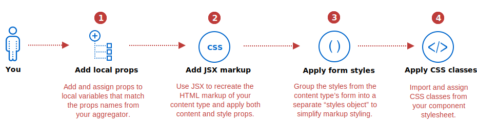
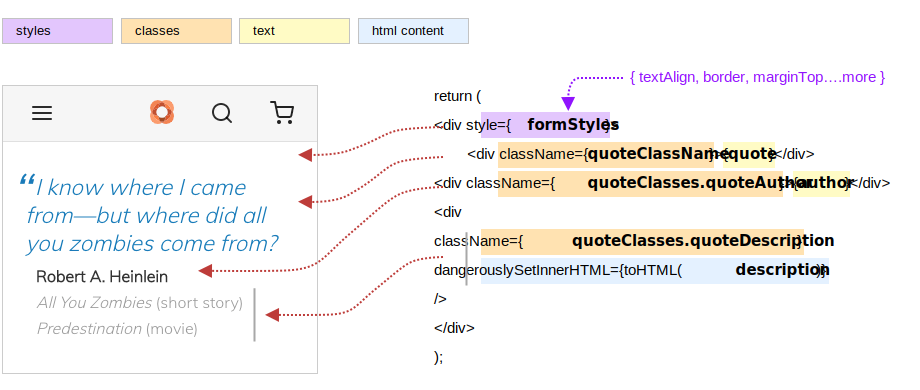

The purpose of a Page Builder component is to recreate a Page Builder content type (from your Magento instance) for display within a PWA app. Developing this component is similar to developing other React components in PWA Studio. However, the properties defined within a Page Builder component are determined by the properties returned from your configuration aggregator. The following steps highlight how to put these properties to use in your component:



## Step 1: Add local props

The first step is to declare local variables that match the names of the props being passed from your aggregator, for destructuring. For our `ExampleQuote` aggregator, we declare and assign these properties as follows:

```js
const ExampleQuote = props => {
    const {
        quote,
        author,
        description,
        textAlign,
        border,
        borderColor,
        borderWidth,
        borderRadius,
        isHidden,
        marginTop,
        marginRight,
        marginBottom,
        marginLeft,
        paddingTop,
        paddingRight,
        paddingBottom,
        paddingLeft,
        cssClasses = []
    } = props;
```

With a destructuring assignment, our component takes a `props` object and copies its values to our local variables. All you need to do is make sure the names of your local variables exactly match the names of the `props` passed from your aggregator. As noted before, you can use `console.log(props)` at the top of your component to see the names of the `keys` being passed in on the props object.

## Step 2: Add JSX markup

Your JSX markup should recreate the HTML structure of your Page Builder content type and provide the slots for rendering its content and styles. For example, here is the markup needed to recreate the structure of our Quote content type and host the local content-related `props` values from our aggregator:

```jsx
const toHTML = str => ({ __html: str });

return (
        <div>
            <div>{quote}</div>
            <div>{author}</div>
            <div dangerouslySetInnerHTML={toHTML(description)} />
        </div>
    );
```

Because our `description` property value is HTML, we need to use React's [dangerouslySetInnerHTML] and `__html` to render it out properly.

## Step 3: Apply form styles

To make it easy to apply all the inline styles from your content type to your Page Builder component, you can create a separate object that contains only the styles retrieved from the content type's form. These styles include those that are retrieved by [utility functions] like `getAdvanced()` and `getBackgroundImages()`.

For our component, we created an object called `formStyles` to group our form styles as shown here:

```js
const formStyles = {
    textAlign,
    border,
    borderColor,
    borderWidth,
    borderRadius,
    isHidden,
    marginTop,
    marginRight,
    marginBottom,
    marginLeft,
    paddingTop,
    paddingRight,
    paddingBottom,
    paddingLeft
};
```

These are the styles returned from the Advanced form section of our Quote content type (using `getAdvanced()`). When they are grouped together as shown, we can apply them all at once to our component, as follows:

```jsx
return (
    <div style={formStyles}>
        <div>{quote}</div>
        <div>{author}</div>
        <div dangerouslySetInnerHTML={toHTML(description)} />
    </div>
);
```

Now we need to apply the CSS classes we used to style the rest of our content type.

## Step 4: Apply CSS classes

Applying CSS classes to your component works the same as apply these classes to any other React component: first import your CSS stylesheet, then add the stylesheet classes to your JSX in the usual way, using `className`.

For our component, we import our component stylesheet:

```js
import quoteStyles from './exampleQuote.css';
```

Then apply the classes within to the correct nodes:

```jsx
return (
    <div style={formStyles}>
        <div className={quoteStyles.quote}>{quote}</div>
        <div className={quoteStyles.quoteAuthor}>{author}</div>
        <div
            className={quoteStyles.quoteDescription}
            dangerouslySetInnerHTML={toHTML(description)}
        />
    </div>
);
```

In this code, we only used one class per node. However, we often need to apply several classes to a node. To do this, you need to create a variable that concatenates your classes into a single string.

For example, the `qoute` node (first child) of our content type requires two classes to reproduce it faithfully in our component: `.quote` and `.blueQuote`. To solve this, we created another variable call `quoteClassName` and used it to add both classes to the `quote` node as follows:

```jsx
const quoteClassName = [quoteClasses.quote, quoteClasses.blueQuote].join(' ');

return (
    <div style={formStyles}>
        <div className={quoteClassName}>{quote}</div>
        <div className={quoteClasses.quoteAuthor}>{author}</div>
        <div
            className={quoteClasses.quoteDescription}
            dangerouslySetInnerHTML={toHTML(description)}
        />
    </div>
);
```

## Component output

If you have followed along using the `ExampleQuote` component, you should see something like this displayed in the PWA Venia app:



[Set up component]: {{ site.baseurl }}
[dangerouslySetInnerHTML]: https://reactjs.org/docs/dom-elements.html#dangerouslysetinnerhtml
[utility functions]: {{ site.baseurl }}
