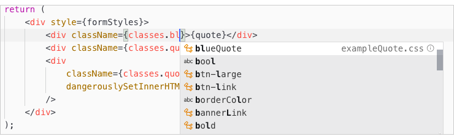

Styling your Page Builder components is the same as styling any other component in PWA Studio. However, the CSS stylesheet for your component should define CSS classes that are comparable to the CSS classes you use on the frontend for original content type (`view/frontend/web/css/source/content-type/<your-content-type>/_import.less`). The following steps highlight the tasks for setting up the CSS classes for your component:


## Step 1: Add content type classes

Start by adding the CSS classes from the frontend css of your content type. For our Quote content type, we copied the frontend styles (`app/code/Example/PageBuilderQuote/view/frontend/web/css/source/content-type/example-quote/_import.less`) and added them to our `exampleQuote.css`.

## Step 2: Convert LESS to CSS

PWA studio uses [CSS Modules][]. It does not include tooling for LESS pre-processors, so you will need to convert your LESS into standard CSS style rules. For example, the LESS stylesheet for our Quote content type is shown here, followed by the equivalent CSS we included in our `exampleQuote.css`.

**Quote content type LESS styles** (`_import.less`):

```scss
& when (@media-common = true) {
    blockquote.quote {
        display: block;
        font-size: 1.3em;
        margin: 1em;
        padding: 0.5em 10px;
        quotes: "\201C" "\201D" "\2018" "\2019";
        text-decoration: none;
        word-break: normal !important;
        line-height: 1.5;
        padding: 0;
        font-weight: 300;
        &:before {
            content: open-quote;
            font-size: 2.6em;
            margin-right: 0.2em;
            vertical-align: -0.35em;
            line-height: 0;
            margin-left: -0.5em;
            font-weight: 300;
        }
        &:after {
            content: close-quote;
            font-size: 0;
            line-height: 0;
            margin-left: 0;
        }
    }
    div {
        &.quote-author {
            text-align: left;
            padding-right: 30px;
            font-size: 14px;
            color: #666;
            margin-left: 1.1em;
        }
        &.quote-description {
            text-align: left;
            padding-right: 30px;
            font-size: 14px;
            color: #999;
            margin-left: 1.1em;
            font-weight: 300;
        }
    }
    .black-quote {
        color: #333333;
        &:before {
            color: #333333;
        }
    }
    .blue-quote {
        color: #007ab9;
        &:before {
            color: #71adcc;
        }
    }
    .green-quote {
        color: #009900;
        &:before {
            color: #009900;
        }
    }
    .red-quote {
        color: #990000;
        &:before {
            color: #990000;
        }
    }
    .purple-quote {
        color: #990099;
        &:before {
            color: #990099;
        }
    }
}
```

**Equivalent component styles** (`exampleQuote.css`):

```css
.quote {
    display: block;
    font-size: 1.4em;
    margin: 1em 1em 0.3em 0.6em;
    quotes: '\201C''\201D''\2018''\2019';
    text-decoration: none;
    font-style: italic;
    word-break: normal !important;
    padding: 0;
    font-weight: 300;
}
.quote:before {
    content: open-quote;
    font-size: 2.4em;
    margin-right: 0.1em;
    vertical-align: -0.3em;
    line-height: 0;
    margin-left: -0.3em;
    font-weight: 300;
}
.quote:after {
    content: close-quote;
    font-size: 0;
    line-height: 0;
    margin-left: 0;
}
.quoteAuthor {
    padding-right: 30px;
    font-size: 16px;
    color: #333333;
    line-height: 24px;
    margin-left: 1.5em;
    word-break: normal !important;
    font-weight: 600;
}
.quoteDescription {
    position: relative;
    padding-right: 30px;
    font-size: 16px;
    line-height: 18px;
    color: #666666;
    margin-left: 1.5em;
    font-weight: 300;
    word-break: normal !important;
}
.blackQuote {
    color: #333333;
}
.blackQuote::before {
    color: #333333;
}
.blueQuote {
    color: #007ab9;
}
.blueQuote::before {
    color: #007ab9;
}
.greenQuote {
    color: #009900;
}
.greenQuote::before {
    color: #009900;
}
.redQuote {
    color: #990000;
}
.redQuote::before {
    color: #990000;
}
.purpleQuote {
    color: #990099;
}
.purpleQuote::before {
    color: #990099;
}
```

## Step 3: Rename classes (optional)

Renaming your class names to use camelCase instead of hyphens allows you to work with CSS classes in your component as if they were JavaScript object properties. For example, if you name the class for the quote author's name as `.quote-author` (with a hyphen), you must access this class in your component like this:

```html
<div className={classes['quote-author']}>{author}</div>
```

This not only uses a string which is prone to errors, but you don't have the benefit of your editor's intellisense.

Compare that to using camelCase for your hyphenated class names by renaming `.quote-author` to `.quoteAuthor` and thereby enabling access to CSS classes using dot syntax, as shown here:



**Protip**: Use camelCase to rename your CSS classes so that you can use dot syntax and intellisense to browse through your style rules more easily when applying them to your component.

[css modules]: 
