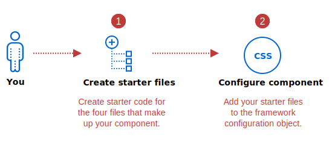
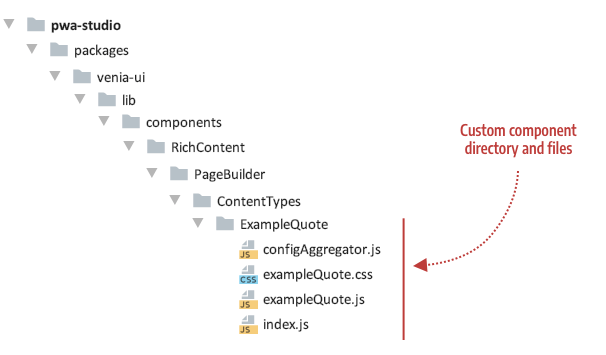
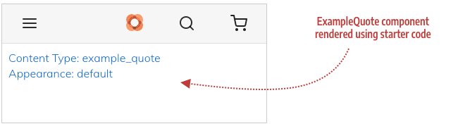

Setting up your component is about getting the essential component files in place so that your component is actively participating in the Page Builder component framework. After you create these files and wire them into the component framework, you can focus all your attention on developing each file to faithfully recreate your content type as a PWA component. The following steps highlight the tasks for setting up your component:



## Step 1: Create starter files

The first thing you need to do within PWA Studio is create the directory and skeleton files needed for your component, as follows:

-   **configAggregator.js** (required) - Function to retrieve content and styling properties from your content type's master format HTML.
-   **myComponent.js** (required) - React component for populating properties that correspond to the original Page Builder content type. For our ExampleQuote, we use `exampleQuote.js`.
-   **myComponent.css** (optional but usually needed) - CSS classes that provide addition styles needed to present your component as desired. For our ExampleQuote, we use `exampleQuote.css`.
-   **index.js** (required)  - Entry file needed to identify your component in PWA Studio.

Currently, you need to add your content type's component, like `ExampleQuote`, to the `ContentTypes` directory, where the native Page Builder components are kept. This will change when we implement different rules for extending Page Builder components. But for now, add your custom content type components as shown here:



Starter code for the `ExampleQuote` component files is provided as follows.

### configAggregator.js

```js
export default (node, props) => {
    return {
        // Retrieve properties from node here
    };
};
```

### exampleQuote.css

```css
/* class for testing setup */
.testClass {
    line-height: 1.4em;
    font-size: 1em;
    color: #0066cc;
}
```

### exampleQuote.js

```jsx
import React from 'react';
import { useStyle } from '../../../../../classify';
import defaultClasses from './exampleQuote.css';
import { shape, string } from 'prop-types';

// Component for testing setup
const ExampleQuote = props => {
    const classes = useStyle(defaultClasses, props.classes);
    return (
        <div className={classes.testClass}>
            <div>Content Type: {props.contentType}</div>
            <div>Appearance: {props.appearance}</div>
        </div>
    );
};

ExampleQuote.propTypes = {
    classes: shape({
        testClass: string
    }),
    contentType: string,
    appearance: string
}

export default ExampleQuote;
```

### index.js

```js
export { default } from './exampleQuote';
```

## Step 2: Configure component

Configuring your component is about connecting your component to the Page Builder component framework. The framework provides a static config object (in `config.js`) that acts as a kind of registry of content types supported within PWA Studio. To include support for your custom content type component, you'll need to add an entry to the `config.js`:


Open the `config.js` file and `import` your `configAggregator`. The import statement for our ExampleQuote is shown here:

```js
import exampleQuoteConfigAggregator from './ContentTypes/ExampleQuote/configAggregator';
```

Add an entry that references your `configAggregator` and `component`, using the name of your content type as the `key`. For our `ExampleQuote`, the name of the Quote content type is `example_quote`, so the entry for our Quote component (`ExampleQuote`) in the config file looks like this:

```js
example_quote: {
    configAggregator: exampleQuoteConfigAggregator,
    component: React.lazy(() => import('./ContentTypes/ExampleQuote'))
},
```

### A note about lazy loading components

When building PWAs, performance is key. That's why we recommend loading less critical components using `React.lazy`. This will result in a very slight delay in that content rendering but will ensure we don't bloat the bundle size for the store. For more information, see the [react lazy loading][] docs on the React site.

By default, we apply `React.lazy` to the following content types: Banner, Slider, Slide Item, Tab, Tab Item, Button, Button Item, Block, Products, HTML, and Divider.

To have your component loaded lazily you simply have to wrap your `component` reference in a call to `React.lazy` as previously shown for the ExampleQuote component:

```js
component: React.lazy(() => import('./ContentTypes/ExampleQuote'))
```

## Test the component setup

After adding these files and hooking them up to the framework through the configuration file (`config.js`), your skeleton component will appear on the Venia home page:



If you see this rendering without errors in the Venia app, you are ready to start developing your content type component.

## Troubleshooting

If you have errors, make sure you have:

1.  Copied the correct starter code for each of the four files.
2.  Added the correct name of your content type to the `config.js` file (`example_quote` if you are using the Quote content type).

[react lazy loading]: https://reactjs.org/docs/code-splitting.html#reactlazy
