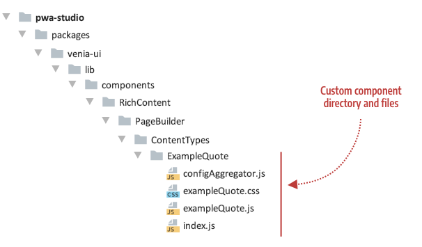
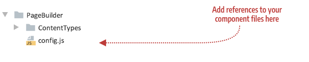

The first thing you need to do within PWA Studio is create the directory and skeleton files needed for your component, as follows:

- **configAggregator.js** (required) - Function you will implement to retrieve content and styling properties from your content type's master format HTML.
- **myComponent.js** (required) - React component you will implement by populating properties that correspond to the original Page Builder content type. For our ExampleQuote, we use `exampleQuote.js`.
- **myComponent.css** (optional but usually needed) - CSS styles that provide the addition styles needed to present your component as desired. For our ExampleQuote, we use `exampleQuote.css`.
- **index.js** (required)  - Entry file needed to identify your component in PWA Studio.

## Component location

Currently, you need to add your content type's component, like `ExampleQuote`, to the `ContentTypes` directory, where the native Page Builder components are kept. This will change when we implement different rules for extending Page Builder components. But for now, add your custom content type components as shown here:



## Component starter code

The purpose of the starter code is simply getting the component files in place so that your component is actively participating in the Page Builder component framework. After this is set up, you can focus all your energy on developing each file to create a fully functioning content type component.

### configAggregator.js

```js
export default (node, props) => {
    return {
        // Retrieve properties from node here
    };
};
```

### exampleQuote.css

```css
/* class for testing setup */
.component-text {
    line-height: 1.4em;
    font-size: 1em;
    color: #0066cc;
}
```

### exampleQuote.js

```jsx
import React from 'react';

// Component for testing setup
const ExampleQuote = props => {
    return (
        <div className={defaultClasses['component-text']}>
            <div>Content Type: <strong>{props.contentType}</strong></div>
            <div>Appearance: <strong>{props.appearance}</strong></div>
        </div>
    );
};

export default ExampleQuote;
```

### index.js

```js
export { default } from './exampleQuote';
```

## Component configuration

Now it is time to connect your component files into the Page Builder component framework. The framework provides a static config object (in `config.js`) that acts as a kind of registry of content types supported within PWA Studio. To include support for your custom content type component, you'll need to add an entry to the `config.js`:



Open the config.js file and `import` your configAggregator. For our ExampleQuote:

```js
import exampleQuoteConfigAggregator from './ContentTypes/ExampleQuote/configAggregator';
```

Add an entry that references your `configAggregator` and `component`, using the name of your content type as the `key`. For our `ExampleQuote`, the name of the Page Builder Quote content type is `example_quote`, so the entry for our Quote component (`ExampleQuote`) in the config file should look like this:

```js
example_quote: {
    configAggregator: exampleQuoteConfigAggregator,
    component: React.lazy(() => import('./ContentTypes/ExampleQuote'))
},
```

### A note about lazy loading components

When building PWAs, performance is key. That's why we recommend loading less critical components using `React.lazy`. This will result in a very slight delay in that content rendering but will ensure we don't bloat the bundle size for the store.

By default, we apply `React.lazy` to the following content types: Banner, Slider, Slide Item, Tab, Tab Item, Button, Button Item, Block, Products, HTML, and Divider.

To have your component loaded lazily you simply have to wrap your `component` reference in a call to `React.lazy` as previously shown for the ExampleQuote component:

```js
component: React.lazy(() => import('./ContentTypes/ExampleQuote'))
```

## Test the component setup

After adding these files and hooking them up to the framework through the configuration file (config.js), your skeleton component should appear on the Venia home page, looking something like this:


Now you are ready to start developing your content type component.
