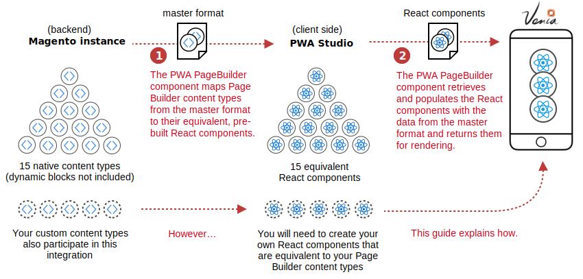
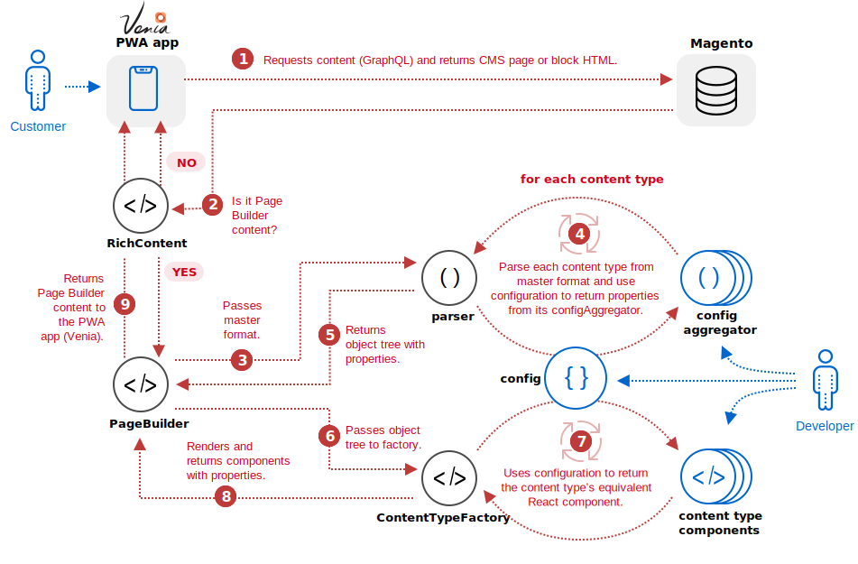

The Page Builder integration into PWA studio provides React components that are equivalent to the native content types in Page Builder. The Page Builder integration code then populates those components with the property data from the master format HTML and renders them to the Venia PWA app. A visualization of this process follows:

## Detailed flow

As part of the Page Builder / PWA integration, we implemented a system in which we can convert Page Builder's master format into a structured format that React and PWA Studio could understand. We did this on the client side to ensure compatibility with all various hosting methods of Magento Commerce currently available. The flow diagram starts with a customer interacting with the Venia PWA app.

1. The Venia app uses a GraphQL query to get CMS content from your Magento store (pages and blocks) and passes the HTML to the `RichContent` component to begin processing.
2. The `RichContent` component determines if the HTML contains Page Builder content, using simple pattern recognition. If the HTML does not include Page Builder content, it is returned to Venia and rendered out as is. If the HTML does include Page Builder content, the HTML (master format) is passed to the `PageBuilder` component.
3. The `PageBuilder` component passes the master format HTML to the `parseStorageHTML` function.
4. For each content type within the master format, the `parseStorageHtml` function use the `contentTypeConfiguration` to call the content type's configAggregator create an object tree of all the content types and associated properties.
5. The `parseStorageHtml` returns the content type object tree to the `PageBuilder` component.
6. The `PageBuilder` component passes the object tree to the `ContentTypeFactory`.
7. For each content type within the object tree, the `ContentTypeFactory` retrieves the React component from the `contentTypeConfiguration`.
8. The `ContentTypeFactory` populates and renders the component with the property values retrieved by the `parseStorageHtml` from the `configAggregator`.
9. The `PageBuilder` component returns all the components needed to render the Page Builder content within the PWA app.

## Developer tasks

To get your custom Page Builder content type to rendered within a PWA app, you need to do three things:

1. Create a React component that is equivalent to your Page Builder content type.
2. Create a configuration aggregator to retrieve the configuration properties from your Page Builder content type.
3. Add your React component and configuration aggregator to the configuration file (config.js).
