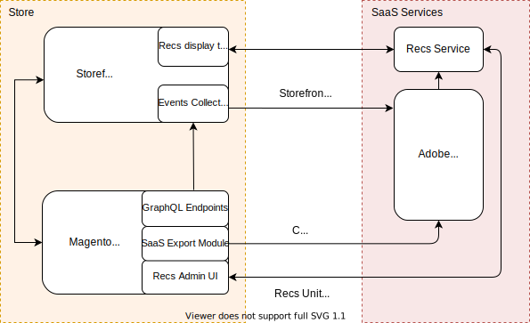

You can integrate Product Recommendations powered by [Adobe Sensei](https://www.adobe.com/sensei.html) into your PWA Studio storefront.

## Integration overview



Magento's [Product Recommendations powered by Adobe Sensei](https://docs.magento.com/user-guide/marketing/product-recommendations.html) is a feature backed by several SaaS services.
The **Store** side includes your PWA storefront, which contains the event collector and recommendations layout template, and the backend, which includes the GraphQL endpoints, SaaS Export module, and the Admin UI.

After you install the Product Recommendations PWA extension on your store, it will start sending [behavioral data](https://devdocs.magento.com/recommendations/events.html) to Adobe Sensei with no additional setup.
Adobe Sensei processes this behavioral data along with the catalog data from the Magento backend and calculates the product associations leveraged by the recommendations service.
At this point, the merchant can create and manage recommendation units from the Magento Admin UI then fetch those product recommendation units from their PWA storefront.

## Install the Product Recommendations module

Product Recommendations support on PWA requires installing the `venia-product-recommendations` package and the Product Recommendations Magento module.

1. You can install the PWA `venia-product-recommendations` package from the NPM registry:

   ```sh
   npm install @magento/venia-product-recommendations
   ```

   {:.bs-callout-info}
   The `venia-product-recommendations` package requires [PWA Studio 10.0.0](https://github.com/magento/pwa-studio/releases/tag/v10.0.0) or later. The `venia-product-recommendations` package also includes the `venia-data-collector` package.

   These two packages contain storefront functionality to collect required behavioral data and render the recommendations. If you need to install the `venia-data-collector` package separately, run:

   ```sh
   npm install @magento/venia-data-collector
   ```

   Some recommendation types use behavioral data from your shoppers to train machine learning models that build personalized recommendations.
   Other recommendation types use catalog data only and do not use any behavioral data.
   See the [Magento user guide](https://docs.magento.com/user-guide/marketing/product-recommendations.html#trainmlmodels) to learn how Adobe Sensei trains machine learning models that results in higher quality recommendations.

1. The backend functionality is provided by the [Magento Product Recommendations module](https://devdocs.magento.com/recommendations/install-configure.html).

1. Additionally, you need to install the `module-data-services-graphql` module that expands Magento's existing GraphQL coverage to include fields required for storefront behavioral data collection.

   ```bash
   composer require magento/module-data-services-graphql
   ```

## Create recommendation units

Creating a product recommendation unit for your PWA storefront is the same as [creating one for a Magento storefront](https://docs.magento.com/user-guide/marketing/create-new-rec.html).
When you create a recommendation unit in the Admin UI panel, you will need to place components that render product recommendations on appropriate storefront pages. You will do this only once per [supported page type](https://docs.magento.com/user-guide/marketing/product-recommendations.html#supportedrecs).

## Render recommendations

To control the recommendation unit placement on your PWA storefront, use the local intercept file. See the [extensibility framework][] documentation to learn more. To render the recommendation unit on your PWA storefront, use one of the methods described below.

### Venia UI component

The `Recommendations` component is part of the [venia-product-recommendations][] package.
It contains React components that do the following:

-  Collect and send behavioral data to Adobe Sensei
-  Fetch recommendations from the recommendations service
-  Render the recommendation unit to your storefront page

#### Example

```jsx
//Render recommendations using visual component
import { VeniaProductRecommendations, PageTypes } from "@magento/venia-product-recommendations"
return <VeniaProductRecommendations pageType={PageTypes.CMS} />
```
### Fetch data only

If you are not using the `venia-product-recommendations` package, you can call the recommendations service and receive a JSON payload.
#### Example

```js
import { Pagetypes, useRecsData, VeniaProductRecommendations } from "@magento/venia-product-recommendations"
const {data, error, isLoading} = useRecsData({pagetype: Pagetypes.CMS})
```

[venia-product-recommendations]: <#custom-react-hooks-and-component>
[extensibility framework]: <#intercept-files>
