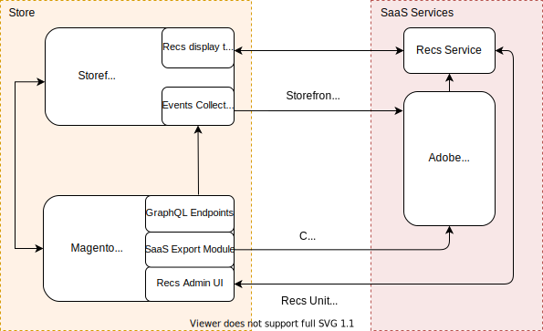

You can integrate [Adobe Sensei](https://www.adobe.com/sensei.html) powered product recommendations into your PWA storefront.
## Integration overview



At a high level, Magento's Product Recommendations are deployed as a SaaS service.
The **Store** side includes your PWA storefront, which contains the event collector and recommendations layout template, and the backend, which includes the GraphQL endpoints, SaaS Export module, and the Admin UI.
Adobe Sensei intelligence services are leveraged on the SaaS services side.

When you install and configure Product Recommendations on PWA Studio, [user events](https://devdocs.magento.com/recommendations/events.html) begin to track and collect behavioral data.
This data is sent to Adobe Sensei.
Adobe Sensei then processes this behavioral data along with your catalog data and calculates product associations that are leveraged by the recommendations service.
At this point, the merchant can create and manage recommendation units from the Magento Admin UI then fetch those product recommendation units from their PWA storefront.

## Install the Product Recommendations module

Product Recommendations support on PWA requires installing the `venia-product-recommendations` module and the Product Recommendations Magento module.

1. You can install the PWA `venia-product-recommendations` module from NPM:

   ```sh
   npm install @magento/venia-product-recommendations
   ```
   This module installs the storefront events that track and collect behavioral data.

1. To install the Magento Product Recommendations module, see the [Magento developer documentation](https://devdocs.magento.com/recommendations/install-configure.html).
This module expands Magento's existing GraphQL API to include fields that are used to fetch the recommendations from the Recommendations Service.

## Create recommendation units

Creating a product recommendation unit for your PWA storefront is similar to [creating one for a Magento storefront](https://docs.magento.com/user-guide/marketing/create-new-rec.html).
The difference is that after you create a recommendation unit, you then need to fetch that recommendation unit from your PWA storefront.

## Fetch recommendations

There are three ways you can fetch product recommendations from your PWA storefront.
If you are using the Venia theme, Magento provides a component that contains the code used to track and collect behavioral events as well as render the recommendation units on your page.
If you are not using the Venia theme, there are other options available to you.

### Venia component (recommended)

The `Recommendations` component is part of the [venia-ui package]: {link technologies/overview/#custom-react-hooks-and-component %} and contains React components that collect and send behavioral data from your storefront to Adobe Sensei, fetch recommendations from the recommendations service, and render the recommendation unit on your PWA storefront page.
#### Example

```js
//Render recommendations using visual component
return <Recommendations pageType={CMS} />
```
### Fetch data only

If you are not using the `venia-ui` package, you can call the recommendations service and receive a payload in JSON.
#### Example

```js
import {CMS} from "@magento/{nameOfOurPackagesThatIsTBD}/lib/recommendations/constants"
import useRecsData from "@magento/{nameOfOurPackagesThatIsTBD}/lib/recommendations/hooks/useRecsData"
```
Because this method does not automatically collect and send behavioral data from your storefront to Adobe Sensei, you will need to add it:

```js
import useRecsWithTrackingProps from "@magento/{nameOfOurPackagesThatIsTBD}/lib/recommendations/hooks/useRecsWithTrackingProps"
import Recommendations from "@magento/{nameOfOurPackagesThatIsTBD}/lib/recommendations/components/Recommendations"
```
### Wrapper functions

To abstract the raw JSON, you can use wrapper functions that collect and send behavioral data from your storefront to Adobe Sensei and fetch recommendation units from the Recommendations service.
#### Example

```js
//recommendations JSON
const recsData = useRecsData({pageType: CMS})
//recommendations JSON with data tracking functions and props spread across
const recsWithTrackingProps useRecsWithTrackingProps({pageType: CMS})
```

If not using the `venia-ui` package, you will need to write code that renders the fetched recommendation unit on your PWA storefront.
