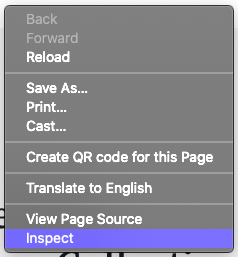
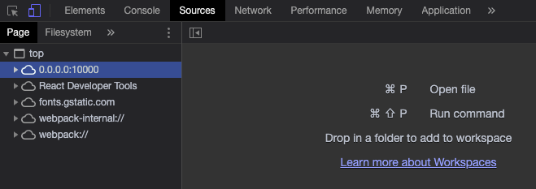
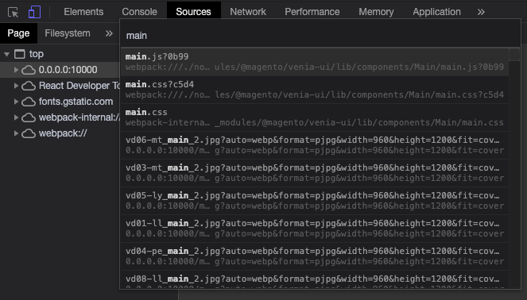
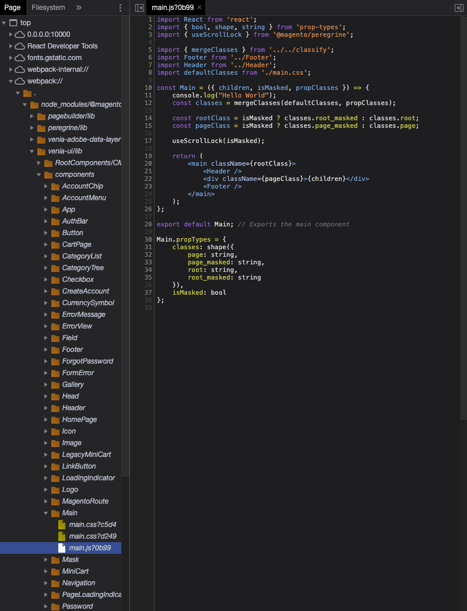

<!--
The reference doc content is generated automatically from the source code.
To update this section, update the doc blocks in the source code
-->



## Examples

Code examples for using the `TargetableModule` class.

### Insert source code

The `TargetableModule` class contains functions that let you insert custom code into different areas in the source code.

```js
const { Targetables } = require('@magento/pwa-buildpack')

module.exports = targets => {
    const targetableFactory = Targetables.using(targets);

    // Create a TargetableModule instance that points to the main.js source
    const MainComponent = targetableFactory.module(
        '@magento/venia-ui/lib/components/Main/main.js'
    );

    // Insert a console log message in the source
    MainComponent.insertAfterSource(
        'const Main = props => {\n',
        '\tconsole.log("Hello World");\n'
    );

}
```

The following example makes the following code modifications to [`main.js`][] for the final bundle:

```diff
  const Main = props => {
+     console.log("Hello World");
      const { children, isMasked } = props;
      const classes = useStyle(defaultClasses, props.classes);

      const rootClass = isMasked ? classes.root_masked : classes.root;
      const pageClass = isMasked ? classes.page_masked : classes.page;

      useScrollLock(isMasked);

      return (
          <main className={rootClass}>
              <Header />
              <div className={pageClass}>{children}</div>
              <Footer />
          </main>
      );
  };
```

### Splice code using instructions

The `spliceSource()` function is a low level code modification function that apply changes based on an instruction object.
The `insertAfterSource()`, `insertBeforeSource()`, and `prependSource()` functions provide a simpler interface and are [facade functions][] for `spliceSource()`.
The first three functions can handle most modification use cases, but if you need to use `spliceSource()` to make changes, you must know how to create a splice instruction object.

[facade functions]: https://en.wikipedia.org/wiki/Facade_pattern

#### Splice instruction object

A splice instruction object tells the `spliceSource()` function, how to change the source code.
The instruction object properties describes what actions to take and where.

| Property | Type    | Description                                                      |
| -------- | ------- | ---------------------------------------------------------------- |
| `insert` | string  | The string to insert at the specified position                   |
| `remove` | integer | The number of characters to remove after a specified position    |
| `at`     | integer | The character index to apply the code change                     |
| `before` | string  | Code changes are applied at the start of this string in the code |
| `after`  | string  | Code changes are applied to the end of this string in the code   |

Instruction objects can only have **one** location property (`at`, `before`, `after`), but one or both action properties (`insert`, `remove`).

#### Splice instruction examples

**Example 1:** The following instruction object makes the same modification as the previous **Insert source code** example:

```js
const instruction = {
    insert: '\tconsole.log("Hello World");\n',
    after: 'const Main = props => {\n'
}

MainComponent.spliceSource(instruction);
```

**Example 2:** This instruction object adds a comment after the default export statement in `main.js`:

```js
const instruction = {
    after: 'export default Main;',
    insert: ' // Exports the main component',
}

MainComponent.spliceSource(instruction);
```

**Example 3:** These instructions add and remove code to refactor `main.js` so it destructures variables earlier in the code:

```js
const destructureInstruction = {
    before: 'props =>',
    remove: 5,
    insert: '({ children, isMasked, propClasses })'
}

MainComponent.spliceSource(destructureInstruction);

const removeInstruction = {
    before: ' .   const { children, isMasked }',
    remove: 42
}

MainComponent.spliceSource(removeInstruction);

const rewriteInstruction = {
    after: 'useStyle(defaultClasses, ',
    remove: 7,
    insert: 'propC'
}

MainComponent.spliceSource(rewriteInstruction);
```

### Debugging source transformations

Debugging source transformation issues is tricky because the code you want to check will be in chunks and minified.
Fortunately, PWA Studio's Webpack configuration provides source maps for [Chrome's developer tools][], which lets you view the modified code in your browser.

[chrome's developer tools]: https://developer.chrome.com/docs/devtools/

#### Debugging with Chrome developer tools

1. Start your development server and navigate to a page in your application that contains your modified code.
2. Right-click on the page and select **Inspect** to open Chrome's web developer tools.

   

3. Select the **Sources** tab in the developer tools panel.

   

4. Open the file searcher by pressing `Command+P` on a Mac, or `Contol+P` on Windows or Linux.

   Type in the name of the file you modified, e.g. `main.js`.

   

5. After the file opens, look for your modifications and validate that they are correct.

   Here, you see the result of the modifications from the previous examples:

   

[transform type]: <#transformtype--enum>
[transform requests]: <>

[`splice-source-loader`]: https://github.com/magento/pwa-studio/blob/develop/packages/pwa-buildpack/lib/WebpackTools/loaders/splice-source-loader.js
[`main.js`]: https://github.com/magento/pwa-studio/blob/develop/packages/venia-ui/lib/components/Main/main.js
