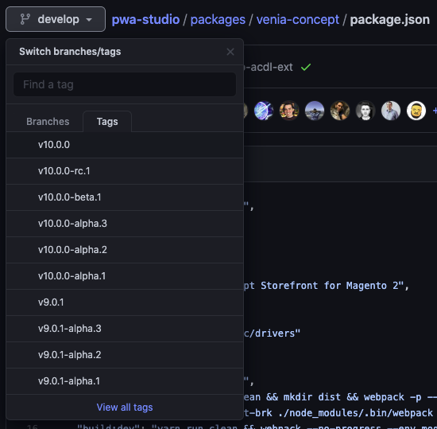

Upgrading to the latest PWA Studio version gives your project access to the new features, bugfixes, and improvements associated with that release.
This topic provides general guidance and best practices for upgrading your storefront project to use the newest PWA Studio release.

## Prerequisites

The contents of this topic applies to storefront projects setup according to the [Setup your project][] tutorial.
These projects use the `venia-concept` package as a template to set up the directory structure and project dependencies.
This is the recommended setup for new projects because it makes version upgrades easier.

[setup your project]: <>

## Update dependencies

The main updates you need to make in your storefront project are the dependency versions in your `package.json` file.
PWA Studio packages are independently versioned, which means their versions may not be the same as the main PWA Studio release version.

If your project uses `yarn`, you can call `yarn add` on each of the `@magento` packages.
This automatically updates the `package.json` file in your project and install the latest versions.

Sample command:

```sh
yarn add @magento/eslint-config @magento/pagebuilder @magento/peregrine @magento/pwa-buildpack @magento/upward-js @magento/venia-ui
```

### Manual updates

If your project uses `npm`, you can still manually edit the `package.json` file with the latest published version.
Compare the contents of your project's `package.json` file with the one in `venia-concept` to see the latest published versions.

You can find the latest package versions by opening the [template project's `package.json` file][] in GitHub and using the version switcher to view the latest release version under the **Tags** tab.
For example, the `package.json` file for the **v10.0.0** release is at:

<https://github.com/magento/pwa-studio/blob/v10.0.0/packages/venia-concept/package.json>

[template project's `package.json` file]: https://github.com/magento/pwa-studio/blob/develop/packages/venia-concept/package.json



Use the contents of this file to update the `@magento` packages listed in your project's `package.json` file.
Next, run `npm install` to install the updated packages.

## Update template files

Updating your dependencies does not update the initial template files in your project.
You must identify and apply these changes manually so that they do not conflict with your own changes.
Use the instructions in the following sections to update your project's template files.

### Clone PWA Studio

To compare changes between the source template and your project, you need a local clone of the PWA Studio repository.
Use the following command to create a local clone:

```sh
git clone git@github.com:magento/pwa-studio.git
```

If you already have a copy of the repository, use the following command to update it with the latest changes:

```sh
git fetch origin
```

Next, checkout the [version tag][] of the recent release.
For example, the following command checks out the state of the repository at version **10.0.0**:

```sh
git checkout v10.0.0
```

[version tag]: https://github.com/magento/pwa-studio/tags

### Identify which template files changed

You can use the PWA Studio repository clone to identify which files changed between versions in the `venia-concept` template package using `git diff`.

For example:

```sh
cd packages/venia-concept && \
git diff --name-only --relative v9.0.1..v10.0.0 . ../
```

This command navigates to the `venia-concept` package and uses the `git diff` command to list the files changed between the `v9.0.1` and `v10.0.0` version tags:

```sh
_buildpack/__tests__/create.spec.js
_buildpack/create.js
package.json
prettier.config.js
src/.storybook/preview-body.html
src/.storybook/webpack.config.js
src/ServiceWorker/Utilities/__tests__/imageCacheHandler.spec.js
src/ServiceWorker/Utilities/imageCacheHandler.js
src/ServiceWorker/setupWorkbox.js
src/registerSW.js
template.html
webpack.config.js
```

### Apply updates

How you apply updates to the template files in your project depends on whether you made changes to that file or not.
If you did not make any changes to your project's template file, you can safely copy over the file into your project to overwrite and update it.

If your project's template file contains any customizations, you must manually apply the updates from the new version.
To find the changes you need to apply, you can use the `git diff` command on individual files:

For example, the following command shows the updates you would need to make to the `webpack.config.js` file:

```sh
git diff v9.0.1..v10.0.0 webpack.config.js
```

You can also use one of the many [diff tools in Visual Studio Code][] or a standalone application, such as [GitHub's desktop application][], to make these comparisons easier.

[diff tools in Visual Studio Code]: https://marketplace.visualstudio.com/search?term=diff&target=VSCode&category=All%20categories&sortBy=Relevance
[github's desktop application]: https://desktop.github.com/

## Check for new environment variables

To check for new or updated environment variables, run a diff on the `envVarDefinitions.json` file in the **pwa-buildpack** package.
For example, the following command shows the updates on that file between versions `v9.0.1` and `v10.0.0`.

```sh
git diff v9.0.1...v10.0.0 packages/pwa-buildpack/envVarDefinitions.json
```

**NOTE:**
If you need to make updates to your local `env` file, you may also need to update the environment variables in your staging and production environments.
