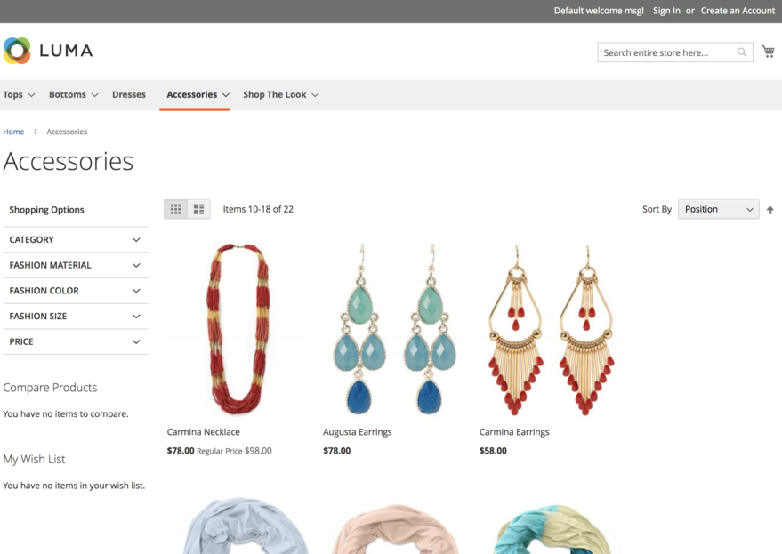

The Venia storefront looks best when running against a Magento 2 backend with the Venia sample data installed.

{: .bs-callout .bs-callout-info}
The sample `.env.dist` file in the Venia project already contains the URL for a Magento 2 cloud instance that has the Venia sample data installed, so
setting up a Magento 2 instance and installing sample data into it is now an optional step.

Follow the instructions on this page to install the Venia sample data into your Magento 2 development instance.

## Prerequisites

* PHP 7.1.3+
* System access to a Magento 2 instance

{: .bs-callout .bs-callout-warning}
If you have the previous `magento2-sample-data` module installed, you need to [remove the sample data modules][] and re-install Magento with a clean database.

## Step 1. Copy or create the deploy script

If you have cloned the [PWA Studio][] repository into the same machine as your Magento instance, copy over the following PWA Studio file into the root directory of your Magento instance:

`packages/venia-concept/deployVeniaSampleData.sh`

If you do not have access to the PWA Studio repository, copy the following content into a file in the root directory of your Magento instance:



## Step 2. Execute the deploy script

Execute the script in the root directory of your Magento instance to add the Venia sample data modules to Magento:

```sh
bash deployVeniaSampleData.sh
```

## Step 3. Install the sample data modules

Run the following command in the Magento root directory to install the Venia data from the modules:

```sh
bin/magento setup:upgrade
```

## Step 4. Reindex the new data

Run the following command in the Magento root directory to reindex the data from the modules:

```sh
bin/magento indexer:reindex
```

## Step 5. Verify installation

Log into the Admin section or visit the store of your Magento instance to verify the sample data installation. 



[remove the sample data modules]: https://devdocs.magento.com/guides/v2.3/install-gde/install/cli/install-cli-sample-data-other.html#inst-sample-remove
[PWA Studio]: https://github.com/magento-research/pwa-studio
